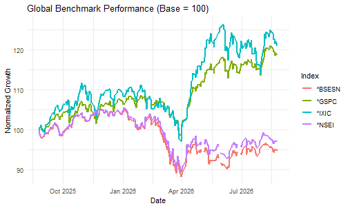

# yahoofinancer Cookbook: 15 Practical Recipes

## Overview

The `yahoofinancer` package provides a tidyverse-first, type-stable
interface for querying market data from Yahoo Finance. This cookbook
compiles 15 end-to-end recipes ranging from baseline data extraction to
technical indicators, quantitative modeling, risk management, and
portfolio performance analysis.

### Required Packages

[`library`](https://rdrr.io/r/base/library.html)`(`[`yahoofinancer`](https://yahoofinancer.rsquaredacademy.com/)`)`` `[`library`](https://rdrr.io/r/base/library.html)`(`[`dplyr`](https://dplyr.tidyverse.org)`)`` `[`library`](https://rdrr.io/r/base/library.html)`(`[`tidyr`](https://tidyr.tidyverse.org)`)`` `[`library`](https://rdrr.io/r/base/library.html)`(`[`ggplot2`](https://ggplot2.tidyverse.org)`)`` `[`library`](https://rdrr.io/r/base/library.html)`(`[`scales`](https://scales.r-lib.org)`)`` `[`library`](https://rdrr.io/r/base/library.html)`(`[`zoo`](https://zoo.R-Forge.R-project.org/)`)`

------------------------------------------------------------------------

## 1. Download Historical Equity Prices

Retrieve daily Open, High, Low, Close, Adjusted Close, and Volume
(OHLCV) price series for a single security using either functional or
object-oriented (R6) interfaces.

`# Functional API`` ``aapl_prices`` ``<-`` `[`yf_download_prices`](https://yahoofinancer.rsquaredacademy.com/reference/yf_download_prices.md)`(`` `` tickers ``=`` ``"AAPL"``,`` `` period ``=`` ``"1y"``,`` `` interval ``=`` ``"1d"`` ``)`` `` `[`head`](https://rdrr.io/r/utils/head.html)`(``aapl_prices``)`` ``#> # A tibble: 6 × 8`` ``#> symbol date open high low close adj_close volume`` ``#> <chr> <dttm> <dbl> <dbl> <dbl> <dbl> <dbl> <dbl>`` ``#> 1 AAPL 2025-08-25 13:30:00 226. 229. 226. 227. 226. 30983100`` ``#> 2 AAPL 2025-08-26 13:30:00 227. 229. 225. 229. 228. 54575100`` ``#> 3 AAPL 2025-08-27 13:30:00 229. 231. 228. 230. 230. 31259500`` ``#> 4 AAPL 2025-08-28 13:30:00 231. 233. 229. 233. 232. 38074700`` ``#> 5 AAPL 2025-08-29 13:30:00 233. 233. 231. 232. 231. 39418400`` ``#> 6 AAPL 2025-09-02 13:30:00 229. 231. 227. 230. 229. 44075600`` `` ``# R6 Class Interface`` ``aapl_obj`` ``<-`` `[`Ticker`](https://yahoofinancer.rsquaredacademy.com/reference/Ticker-class.md)`$``new``(``"AAPL"``)`` ``aapl_history`` ``<-`` ``aapl_obj``$``get_history``(``period ``=`` ``"1y"``, interval ``=`` ``"1d"``)`` `` `[`head`](https://rdrr.io/r/utils/head.html)`(``aapl_history``)`` ``#> # A tibble: 6 × 8`` ``#> symbol date open high low close adj_close volume`` ``#> <chr> <dttm> <dbl> <dbl> <dbl> <dbl> <dbl> <dbl>`` ``#> 1 AAPL 2025-08-25 13:30:00 226. 229. 226. 227. 226. 30983100`` ``#> 2 AAPL 2025-08-26 13:30:00 227. 229. 225. 229. 228. 54575100`` ``#> 3 AAPL 2025-08-27 13:30:00 229. 231. 228. 230. 230. 31259500`` ``#> 4 AAPL 2025-08-28 13:30:00 231. 233. 229. 233. 232. 38074700`` ``#> 5 AAPL 2025-08-29 13:30:00 233. 233. 231. 232. 231. 39418400`` ``#> 6 AAPL 2025-09-02 13:30:00 229. 231. 227. 230. 229. 44075600`

### Variations & Tips

- **Explicit Date Boundaries**: Query fixed historical windows using
  `start` and `end`:

`aapl_custom`` ``<-`` `[`yf_download_prices`](https://yahoofinancer.rsquaredacademy.com/reference/yf_download_prices.md)`(`` `` tickers ``=`` ``"AAPL"``,`` `` start ``=`` ``"2024-01-01"``,`` `` end ``=`` ``"2024-12-31"``,`` `` interval ``=`` ``"1d"`` ``)`

- **Inspect Security Metadata via R6**:

[`cat`](https://rdrr.io/r/base/cat.html)`(``"Currency: "``, ``aapl_obj``$``currency``, ``"\n"``)`` ``#> Currency: USD`` `[`cat`](https://rdrr.io/r/base/cat.html)`(``"Exchange: "``, ``aapl_obj``$``exchange_name``, ``"\n"``)`` ``#> Exchange: NMS`` `[`cat`](https://rdrr.io/r/base/cat.html)`(``"Timezone: "``, ``aapl_obj``$``timezone``, ``"\n"``)`` ``#> Timezone: EDT`

------------------------------------------------------------------------

## 2. Batch Download Multiple Tickers

Retrieve and stack price series for a diversified universe of equities
into a single long-format tibble in one vectorized call.

`symbols`` ``<-`` `[`c`](https://rdrr.io/r/base/c.html)`(``"AAPL"``, ``"MSFT"``, ``"GOOGL"``, ``"NVDA"``, ``"TCS.NS"``)`` `` ``basket_prices`` ``<-`` `[`yf_download_prices`](https://yahoofinancer.rsquaredacademy.com/reference/yf_download_prices.md)`(`` `` tickers ``=`` ``symbols``,`` `` period ``=`` ``"6mo"``,`` `` interval ``=`` ``"1d"`` ``)`` `` ``# Inspect observation counts per ticker`` ``basket_prices`` ``|>`` `` `[`count`](https://dplyr.tidyverse.org/reference/count.html)`(``symbol``)`` ``#> # A tibble: 5 × 2`` ``#> symbol n`` ``#> <chr> <int>`` ``#> 1 AAPL 125`` ``#> 2 GOOGL 125`` ``#> 3 MSFT 125`` ``#> 4 NVDA 125`` ``#> 5 TCS.NS 125`

### Variations & Tips

- **Faceted Multi-Asset Price Plot**: Compare absolute price
  trajectories across assets using `ggplot2`:

[`ggplot`](https://ggplot2.tidyverse.org/reference/ggplot.html)`(``basket_prices``, `[`aes`](https://ggplot2.tidyverse.org/reference/aes.html)`(``x ``=`` ``date``, y ``=`` ``adj_close``, color ``=`` ``symbol``)``)`` ``+`` `` `[`geom_line`](https://ggplot2.tidyverse.org/reference/geom_path.html)`(``show.legend ``=`` ``FALSE``)`` ``+`` `` `[`facet_wrap`](https://ggplot2.tidyverse.org/reference/facet_wrap.html)`(``~`` ``symbol``, scales ``=`` ``"free_y"``)`` ``+`` `` `[`labs`](https://ggplot2.tidyverse.org/reference/labs.html)`(`` `` title ``=`` ``"Historical Price Series by Security"``,`` `` x ``=`` ``"Date"``,`` `` y ``=`` ``"Adjusted Close Price"`` `` ``)`` ``+`` `` `[`theme_minimal`](https://ggplot2.tidyverse.org/reference/ggtheme.html)`(``)`


plot of chunk recipe-2-faceted-plot

------------------------------------------------------------------------

## 3. Intraday Price Series & Timeframes

Retrieve high-frequency intraday candles (`1m`, `5m`, `15m`, `60m`) to
examine intraday volatility, liquidity patterns, and trading
microstructure.

`intraday_5m`` ``<-`` `[`yf_download_prices`](https://yahoofinancer.rsquaredacademy.com/reference/yf_download_prices.md)`(`` `` tickers ``=`` ``"MSFT"``,`` `` period ``=`` ``"5d"``,`` `` interval ``=`` ``"5m"`` ``)`` `` `[`head`](https://rdrr.io/r/utils/head.html)`(``intraday_5m``)`` ``#> # A tibble: 6 × 8`` ``#> symbol date open high low close adj_close volume`` ``#> <chr> <dttm> <dbl> <dbl> <dbl> <dbl> <dbl> <dbl>`` ``#> 1 MSFT 2026-08-18 13:30:00 482. 483. 477. 479. 479. 1477683`` ``#> 2 MSFT 2026-08-18 13:35:00 479. 483. 479. 483. 483. 388264`` ``#> 3 MSFT 2026-08-18 13:40:00 483. 484. 483. 483. 483. 437979`` ``#> 4 MSFT 2026-08-18 13:45:00 483. 483. 482. 482. 482. 238777`` ``#> 5 MSFT 2026-08-18 13:50:00 482. 483. 480. 482. 482. 477575`` ``#> 6 MSFT 2026-08-18 13:55:00 482. 482. 479. 480. 480. 351820`

### Variations & Tips

- **Hourly Candle Tracking**: Download 1-hour candles over the past
  month:

`intraday_1h`` ``<-`` `[`yf_download_prices`](https://yahoofinancer.rsquaredacademy.com/reference/yf_download_prices.md)`(`` `` tickers ``=`` ``"MSFT"``,`` `` period ``=`` ``"1mo"``,`` `` interval ``=`` ``"60m"`` ``)`

- **Intraday Volume Distribution**: Visualize intraday trading volume
  bars:

[`ggplot`](https://ggplot2.tidyverse.org/reference/ggplot.html)`(``intraday_5m``, `[`aes`](https://ggplot2.tidyverse.org/reference/aes.html)`(``x ``=`` ``date``, y ``=`` ``volume``)``)`` ``+`` `` `[`geom_col`](https://ggplot2.tidyverse.org/reference/geom_bar.html)`(``fill ``=`` ``"#4f46e5"``, alpha ``=`` ``0.8``)`` ``+`` `` `[`scale_y_continuous`](https://ggplot2.tidyverse.org/reference/scale_continuous.html)`(``labels ``=`` `[`label_number`](https://scales.r-lib.org/reference/label_number.html)`(``scale_cut ``=`` `[`cut_short_scale`](https://scales.r-lib.org/reference/number.html)`(``)``)``)`` ``+`` `` `[`labs`](https://ggplot2.tidyverse.org/reference/labs.html)`(`` `` title ``=`` ``"MSFT 5-Minute Intraday Volume"``,`` `` x ``=`` ``"Timestamp (UTC)"``,`` `` y ``=`` ``"Volume"`` `` ``)`` ``+`` `` `[`theme_minimal`](https://ggplot2.tidyverse.org/reference/ggtheme.html)`(``)`


plot of chunk recipe-3-volume-plot

------------------------------------------------------------------------

## 4. Real-Time Market Overview & Regional Filtering

Retrieve live market snapshots across international equity indices,
currencies, and commodities, then filter for specific regional
exchanges.

`market_overview`` ``<-`` `[`get_market_summary`](https://yahoofinancer.rsquaredacademy.com/reference/get_market_summary.md)`(``as_tibble ``=`` ``TRUE``)`` `` ``# Filter for benchmark indices and currencies in market overview`` ``us_overview`` ``<-`` ``market_overview`` ``|>`` `` `[`filter`](https://dplyr.tidyverse.org/reference/filter.html)`(`[`grepl`](https://rdrr.io/r/base/grep.html)`(``"S&P|Nasdaq|Dow|EUR/USD|Gold|Crude"``, ``short_name``, ignore.case ``=`` ``TRUE``)``)`` `` `[`print`](https://rdrr.io/r/base/print.html)`(``us_overview``)`` ``#> # A tibble: 6 × 9`` ``#> symbol short_name regular_market_price regular_market_change`` ``#> <chr> <chr> <dbl> <dbl>`` ``#> 1 ES=F S&P Futures 7697 27.2 `` ``#> 2 YM=F Dow Futures 53689 200 `` ``#> 3 NQ=F Nasdaq Futures 29330 224. `` ``#> 4 CL=F Crude Oil 82.6 -2.41 `` ``#> 5 GC=F Gold 4696. -1.90 `` ``#> 6 EURUSD=X EUR/USD 1.17 -0.000408`` ``#> # ℹ 5 more variables: regular_market_change_percent <dbl>,`` ``#> # regular_market_previous_close <dbl>, market_state <chr>, exchange <chr>,`` ``#> # market_time <dttm>`

### Variations & Tips

- **Filter for Commodities & Crypto**:

`commodities_crypto`` ``<-`` ``market_overview`` ``|>`` `` `[`filter`](https://dplyr.tidyverse.org/reference/filter.html)`(`[`grepl`](https://rdrr.io/r/base/grep.html)`(``"Gold|Crude|Silver|BTC|ETH"``, ``short_name``, ignore.case ``=`` ``TRUE``)``)`

- **Filter for Major European Indices**:

`european_market`` ``<-`` ``market_overview`` ``|>`` `` `[`filter`](https://dplyr.tidyverse.org/reference/filter.html)`(`[`grepl`](https://rdrr.io/r/base/grep.html)`(``"DAX|FTSE|CAC|ESTX"``, ``short_name``, ignore.case ``=`` ``TRUE``)``)`

------------------------------------------------------------------------

## 5. Download Benchmark Index History

Retrieve historical price series for major benchmark indices (`^GSPC`,
`^IXIC`, `^NSEI`, `^BSESN`) and normalize prices to a common base of 100
for comparative performance tracking.

`benchmark_symbols`` ``<-`` `[`c`](https://rdrr.io/r/base/c.html)`(``"^GSPC"``, ``"^IXIC"``, ``"^NSEI"``, ``"^BSESN"``)`` `` ``benchmark_prices`` ``<-`` `[`yf_download_prices`](https://yahoofinancer.rsquaredacademy.com/reference/yf_download_prices.md)`(`` `` tickers ``=`` ``benchmark_symbols``,`` `` period ``=`` ``"1y"``,`` `` interval ``=`` ``"1d"`` ``)`` `` ``# Normalize price levels (Base = 100)`` ``normalized_indices`` ``<-`` ``benchmark_prices`` ``|>`` `` `[`group_by`](https://dplyr.tidyverse.org/reference/group_by.html)`(``symbol``)`` ``|>`` `` `[`arrange`](https://dplyr.tidyverse.org/reference/arrange.html)`(``date``, .by_group ``=`` ``TRUE``)`` ``|>`` `` `[`mutate`](https://dplyr.tidyverse.org/reference/mutate.html)`(``indexed_price ``=`` ``(``close`` ``/`` `[`first`](https://dplyr.tidyverse.org/reference/nth.html)`(``close``)``)`` ``*`` ``100``)`` ``|>`` `` `[`ungroup`](https://dplyr.tidyverse.org/reference/group_by.html)`(``)`` `` `[`ggplot`](https://ggplot2.tidyverse.org/reference/ggplot.html)`(``normalized_indices``, `[`aes`](https://ggplot2.tidyverse.org/reference/aes.html)`(``x ``=`` ``date``, y ``=`` ``indexed_price``, color ``=`` ``symbol``)``)`` ``+`` `` `[`geom_line`](https://ggplot2.tidyverse.org/reference/geom_path.html)`(``linewidth ``=`` ``0.8``)`` ``+`` `` `[`labs`](https://ggplot2.tidyverse.org/reference/labs.html)`(`` `` title ``=`` ``"Global Benchmark Performance (Base = 100)"``,`` `` x ``=`` ``"Date"``,`` `` y ``=`` ``"Normalized Growth"``,`` `` color ``=`` ``"Index"`` `` ``)`` ``+`` `` `[`theme_minimal`](https://ggplot2.tidyverse.org/reference/ggtheme.html)`(``)`



plot of chunk recipe-5-core

### Variations & Tips

- **Indian Sectoral Indices**: Track major sector sub-indices:

`sectoral_symbols`` ``<-`` `[`c`](https://rdrr.io/r/base/c.html)`(``"^CNXIT"``, ``"^NSEBANK"``, ``"^CNXAUTO"``)`` ``sectoral_prices`` ``<-`` `[`yf_download_prices`](https://yahoofinancer.rsquaredacademy.com/reference/yf_download_prices.md)`(``sectoral_symbols``, period ``=`` ``"1y"``, interval ``=`` ``"1d"``)`

- **Index Class R6 Query & Latest Quote**:

`nifty`` ``<-`` `[`Index`](https://yahoofinancer.rsquaredacademy.com/reference/Indice-class.md)`$``new``(``"^NSEI"``)`` ``nifty_quote`` ``<-`` `[`yf_get_index_quotes`](https://yahoofinancer.rsquaredacademy.com/reference/yf_get_index_quotes.md)`(``"^NSEI"``)`` `[`cat`](https://rdrr.io/r/base/cat.html)`(``"Index Symbol: "``, ``nifty``$``symbol``, ``"\n"``)`` ``#> Index Symbol: ^NSEI`` `[`cat`](https://rdrr.io/r/base/cat.html)`(``"Latest Close: "``, `[`tail`](https://rdrr.io/r/utils/head.html)`(``nifty_quote``$``close``, ``1``)``, ``"\n"``)`` ``#> Latest Close: 24219.1`

------------------------------------------------------------------------

## 6. Historical Currency & Forex Conversions

Convert foreign asset valuations into a local base currency by
retrieving spot and historical foreign exchange rates via ISO 4217
currency pairs.

`# 1. Fetch Apple USD prices`` ``aapl`` ``<-`` `[`yf_download_prices`](https://yahoofinancer.rsquaredacademy.com/reference/yf_download_prices.md)`(``"AAPL"``, period ``=`` ``"6mo"``)`` ``|>`` `` `[`mutate`](https://dplyr.tidyverse.org/reference/mutate.html)`(``date_day ``=`` `[`as.Date`](https://rdrr.io/pkg/zoo/man/yearmon.html)`(``date``)``)`` `` ``# 2. Fetch USD/INR exchange rates`` ``usd_inr`` ``<-`` `[`currency_converter`](https://yahoofinancer.rsquaredacademy.com/reference/currency_converter.md)`(``"USD"``, ``"INR"``, period ``=`` ``"6mo"``)`` ``|>`` `` `[`mutate`](https://dplyr.tidyverse.org/reference/mutate.html)`(``date_day ``=`` `[`as.Date`](https://rdrr.io/pkg/zoo/man/yearmon.html)`(``date``)``)`` ``|>`` `` `[`select`](https://dplyr.tidyverse.org/reference/select.html)`(``date_day``, fx_rate ``=`` ``close``)`` `` ``# 3. Join and compute share price in INR`` ``aapl_inr`` ``<-`` ``aapl`` ``|>`` `` `[`inner_join`](https://dplyr.tidyverse.org/reference/mutate-joins.html)`(``usd_inr``, by ``=`` ``"date_day"``)`` ``|>`` `` `[`mutate`](https://dplyr.tidyverse.org/reference/mutate.html)`(``close_inr ``=`` ``close`` ``*`` ``fx_rate``)`` ``|>`` `` `[`select`](https://dplyr.tidyverse.org/reference/select.html)`(``date_day``, close_usd ``=`` ``close``, ``fx_rate``, ``close_inr``)`` `` `[`head`](https://rdrr.io/r/utils/head.html)`(``aapl_inr``)`` ``#> # A tibble: 6 × 4`` ``#> date_day close_usd fx_rate close_inr`` ``#> <date> <dbl> <dbl> <dbl>`` ``#> 1 2026-02-25 274. 90.9 24932.`` ``#> 2 2026-02-26 273. 91.0 24825.`` ``#> 3 2026-02-27 264. 91.0 24042.`` ``#> 4 2026-03-02 265. 91.1 24111.`` ``#> 5 2026-03-03 264. 91.6 24150.`` ``#> 6 2026-03-04 263. 92.0 24154.`

### Variations & Tips

- **Inspect Available ISO Currency Codes**:

`supported_currencies`` ``<-`` `[`get_currencies`](https://yahoofinancer.rsquaredacademy.com/reference/get_currencies.md)`(``)`` `[`head`](https://rdrr.io/r/utils/head.html)`(``supported_currencies``)`` ``#> short_name long_name symbol local_long_name`` ``#> 1 FJD Fijian Dollar FJD Fijian Dollar`` ``#> 2 MXN Mexican Peso MXN Mexican Peso`` ``#> 3 SCR Seychellois Rupee SCR Seychellois Rupee`` ``#> 4 CDF Congolese Franc CDF Congolese Franc`` ``#> 5 BBD Barbadian Dollar BBD Barbadian Dollar`` ``#> 6 GTQ Guatemalan Quetzal GTQ Guatemalan Quetzal`

- **Direct Forex Pair Download**: Query exchange rates using the `=X`
  ticker convention:

`fx_basket`` ``<-`` `[`yf_download_prices`](https://yahoofinancer.rsquaredacademy.com/reference/yf_download_prices.md)`(`[`c`](https://rdrr.io/r/base/c.html)`(``"EURUSD=X"``, ``"GBPUSD=X"``, ``"USDJPY=X"``)``, period ``=`` ``"3mo"``)`

------------------------------------------------------------------------

## 7. Validate Ticker Symbols Before Pipelines

Sanitize, filter, and audit arbitrary universes of ticker symbols prior
to running batch download pipelines to prevent failures caused by
delisted or malformed symbols.

`raw_symbols`` ``<-`` `[`c`](https://rdrr.io/r/base/c.html)`(``"AAPL"``, ``"INVALID_XYZ"``, ``"TCS.NS"``, ``"NOT_REAL_123"``, ``"MSFT"``)`` `` ``# 1. Return valid tickers only`` ``clean_symbols`` ``<-`` `[`validate`](https://yahoofinancer.rsquaredacademy.com/reference/validate.md)`(``raw_symbols``)`` `[`print`](https://rdrr.io/r/base/print.html)`(``clean_symbols``)`` ``#> [1] "AAPL" "TCS.NS" "MSFT"`` `` ``# 2. Named logical audit vector`` ``validation_status`` ``<-`` `[`validate`](https://yahoofinancer.rsquaredacademy.com/reference/validate.md)`(``raw_symbols``, return_logical ``=`` ``TRUE``)`` `[`print`](https://rdrr.io/r/base/print.html)`(``validation_status``)`` ``#> AAPL INVALID_XYZ TCS.NS NOT_REAL_123 MSFT `` ``#> TRUE FALSE TRUE FALSE TRUE`` `` ``# 3. Clean inline before download`` ``clean_prices`` ``<-`` `[`yf_download_prices`](https://yahoofinancer.rsquaredacademy.com/reference/yf_download_prices.md)`(`` `` tickers ``=`` `[`validate`](https://yahoofinancer.rsquaredacademy.com/reference/validate.md)`(``raw_symbols``)``,`` `` period ``=`` ``"3mo"`` ``)`` `` `[`head`](https://rdrr.io/r/utils/head.html)`(``clean_prices``)`` ``#> # A tibble: 6 × 8`` ``#> symbol date open high low close adj_close volume`` ``#> <chr> <dttm> <dbl> <dbl> <dbl> <dbl> <dbl> <dbl>`` ``#> 1 AAPL 2026-05-26 13:30:00 310. 312. 308. 308. 308. 48000500`` ``#> 2 AAPL 2026-05-27 13:30:00 308. 313. 308. 311. 311. 50430900`` ``#> 3 AAPL 2026-05-28 13:30:00 311. 313. 310. 313. 312. 48220400`` ``#> 4 AAPL 2026-05-29 13:30:00 312. 315 310. 312. 312. 70026800`` ``#> 5 AAPL 2026-06-01 13:30:00 310. 311. 305. 306. 306. 48849900`` ``#> 6 AAPL 2026-06-02 13:30:00 307. 315. 307. 315. 315. 44534700`

### Variations & Tips

- **Audit and Warning Log for Rejected Tickers**:

`status`` ``<-`` `[`validate`](https://yahoofinancer.rsquaredacademy.com/reference/validate.md)`(``raw_symbols``, return_logical ``=`` ``TRUE``)`` ``invalid_tickers`` ``<-`` `[`names`](https://rdrr.io/r/base/names.html)`(``status``[``!``status``]``)`` `` ``if`` ``(`[`length`](https://rdrr.io/r/base/length.html)`(``invalid_tickers``)`` ``>`` ``0``)`` ``{`` `` `[`warning`](https://rdrr.io/r/base/warning.html)`(``"Dropped invalid tickers: "``, `[`paste`](https://rdrr.io/r/base/paste.html)`(``invalid_tickers``, collapse ``=`` ``", "``)``)`` ``}`

------------------------------------------------------------------------

## 8. Calculate Daily Percentage Returns

Calculate simple discrete percentage returns and continuous log returns
across multiple securities using standardized adjusted close prices
(`adj_close`).

`symbols`` ``<-`` `[`c`](https://rdrr.io/r/base/c.html)`(``"AAPL"``, ``"MSFT"``, ``"GOOGL"``)`` `` ``returns_df`` ``<-`` `[`yf_download_prices`](https://yahoofinancer.rsquaredacademy.com/reference/yf_download_prices.md)`(``symbols``, period ``=`` ``"1y"``, interval ``=`` ``"1d"``)`` ``|>`` `` `[`group_by`](https://dplyr.tidyverse.org/reference/group_by.html)`(``symbol``)`` ``|>`` `` `[`arrange`](https://dplyr.tidyverse.org/reference/arrange.html)`(``date``, .by_group ``=`` ``TRUE``)`` ``|>`` `` `[`mutate`](https://dplyr.tidyverse.org/reference/mutate.html)`(`` `` daily_return ``=`` ``(``adj_close`` ``/`` `[`lag`](https://dplyr.tidyverse.org/reference/lead-lag.html)`(``adj_close``)``)`` ``-`` ``1``,`` `` log_return ``=`` `[`log`](https://rdrr.io/r/base/Log.html)`(``adj_close`` ``/`` `[`lag`](https://dplyr.tidyverse.org/reference/lead-lag.html)`(``adj_close``)``)`` `` ``)`` ``|>`` `` `[`filter`](https://dplyr.tidyverse.org/reference/filter.html)`(``!`[`is.na`](https://rdrr.io/r/base/NA.html)`(``daily_return``)``)`` ``|>`` `` `[`ungroup`](https://dplyr.tidyverse.org/reference/group_by.html)`(``)`` `` `[`head`](https://rdrr.io/r/utils/head.html)`(``returns_df``)`` ``#> # A tibble: 6 × 10`` ``#> symbol date open high low close adj_close volume`` ``#> <chr> <dttm> <dbl> <dbl> <dbl> <dbl> <dbl> <dbl>`` ``#> 1 AAPL 2025-08-26 13:30:00 227. 229. 225. 229. 228. 54575100`` ``#> 2 AAPL 2025-08-27 13:30:00 229. 231. 228. 230. 230. 31259500`` ``#> 3 AAPL 2025-08-28 13:30:00 231. 233. 229. 233. 232. 38074700`` ``#> 4 AAPL 2025-08-29 13:30:00 233. 233. 231. 232. 231. 39418400`` ``#> 5 AAPL 2025-09-02 13:30:00 229. 231. 227. 230. 229. 44075600`` ``#> 6 AAPL 2025-09-03 13:30:00 237. 239. 234. 238. 238. 66427800`` ``#> # ℹ 2 more variables: daily_return <dbl>, log_return <dbl>`

### Variations & Tips

- **Visualizing Return Distributions**: Plot overlapping density curves
  to evaluate return dispersion and tail thickness:

[`ggplot`](https://ggplot2.tidyverse.org/reference/ggplot.html)`(``returns_df``, `[`aes`](https://ggplot2.tidyverse.org/reference/aes.html)`(``x ``=`` ``daily_return``, fill ``=`` ``symbol``)``)`` ``+`` `` `[`geom_density`](https://ggplot2.tidyverse.org/reference/geom_density.html)`(``alpha ``=`` ``0.4``)`` ``+`` `` `[`scale_x_continuous`](https://ggplot2.tidyverse.org/reference/scale_continuous.html)`(``labels ``=`` `[`label_percent`](https://scales.r-lib.org/reference/label_percent.html)`(``accuracy ``=`` ``0.1``)``)`` ``+`` `` `[`labs`](https://ggplot2.tidyverse.org/reference/labs.html)`(`` `` title ``=`` ``"Daily Return Distributions"``,`` `` x ``=`` ``"Daily Percentage Return"``,`` `` y ``=`` ``"Density"``,`` `` fill ``=`` ``"Ticker"`` `` ``)`` ``+`` `` `[`theme_minimal`](https://ggplot2.tidyverse.org/reference/ggtheme.html)`(``)`


plot of chunk recipe-8-density-plot

- **Summary Statistics Table**:

`returns_summary`` ``<-`` ``returns_df`` ``|>`` `` `[`group_by`](https://dplyr.tidyverse.org/reference/group_by.html)`(``symbol``)`` ``|>`` `` `[`summarise`](https://dplyr.tidyverse.org/reference/summarise.html)`(`` `` trading_days ``=`` `[`n`](https://dplyr.tidyverse.org/reference/context.html)`(``)``,`` `` mean_daily ``=`` `[`mean`](https://rdrr.io/r/base/mean.html)`(``daily_return``)``,`` `` sd_daily ``=`` `[`sd`](https://rdrr.io/r/stats/sd.html)`(``daily_return``)``,`` `` annual_return ``=`` ``mean_daily`` ``*`` ``252``,`` `` annual_vol ``=`` ``sd_daily`` ``*`` `[`sqrt`](https://rdrr.io/r/base/MathFun.html)`(``252``)`` `` ``)`` `[`print`](https://rdrr.io/r/base/print.html)`(``returns_summary``)`` ``#> # A tibble: 3 × 6`` ``#> symbol trading_days mean_daily sd_daily annual_return annual_vol`` ``#> <chr> <int> <dbl> <dbl> <dbl> <dbl>`` ``#> 1 AAPL 250 0.00139 0.0158 0.350 0.251`` ``#> 2 GOOGL 250 0.00227 0.0206 0.573 0.327`` ``#> 3 MSFT 250 0.0000991 0.0204 0.0250 0.323`

------------------------------------------------------------------------

## 9. Multi-Asset Return Correlation Matrix

Reshape multi-asset return series into a wide format to compute pairwise
Pearson correlation coefficients, assess sector co-movement, and
evaluate diversification benefits.

`symbols`` ``<-`` `[`c`](https://rdrr.io/r/base/c.html)`(``"AAPL"``, ``"MSFT"``, ``"NVDA"``, ``"GLD"``, ``"^GSPC"``)`` `` ``prices`` ``<-`` `[`yf_download_prices`](https://yahoofinancer.rsquaredacademy.com/reference/yf_download_prices.md)`(``symbols``, period ``=`` ``"1y"``, interval ``=`` ``"1d"``)`` `` ``returns_matrix`` ``<-`` ``prices`` ``|>`` `` `[`group_by`](https://dplyr.tidyverse.org/reference/group_by.html)`(``symbol``)`` ``|>`` `` `[`arrange`](https://dplyr.tidyverse.org/reference/arrange.html)`(``date``, .by_group ``=`` ``TRUE``)`` ``|>`` `` `[`mutate`](https://dplyr.tidyverse.org/reference/mutate.html)`(``daily_return ``=`` ``(``adj_close`` ``/`` `[`lag`](https://dplyr.tidyverse.org/reference/lead-lag.html)`(``adj_close``)``)`` ``-`` ``1``)`` ``|>`` `` `[`filter`](https://dplyr.tidyverse.org/reference/filter.html)`(``!`[`is.na`](https://rdrr.io/r/base/NA.html)`(``daily_return``)``)`` ``|>`` `` `[`ungroup`](https://dplyr.tidyverse.org/reference/group_by.html)`(``)`` ``|>`` `` `[`select`](https://dplyr.tidyverse.org/reference/select.html)`(``date``, ``symbol``, ``daily_return``)`` ``|>`` `` `[`pivot_wider`](https://tidyr.tidyverse.org/reference/pivot_wider.html)`(``names_from ``=`` ``symbol``, values_from ``=`` ``daily_return``)`` `` ``cor_matrix`` ``<-`` `[`cor`](https://rdrr.io/r/stats/cor.html)`(`[`select`](https://dplyr.tidyverse.org/reference/select.html)`(``returns_matrix``, ``-``date``)``, use ``=`` ``"pairwise.complete.obs"``)`` `[`round`](https://rdrr.io/r/base/Round.html)`(``cor_matrix``, ``2``)`` ``#> AAPL GLD MSFT NVDA ^GSPC`` ``#> AAPL 1.00 0.09 0.11 0.11 0.38`` ``#> GLD 0.09 1.00 0.08 0.22 0.32`` ``#> MSFT 0.11 0.08 1.00 0.27 0.38`` ``#> NVDA 0.11 0.22 0.27 1.00 0.66`` ``#> ^GSPC 0.38 0.32 0.38 0.66 1.00`

### Variations & Tips

- **Correlation Heatmap**: Visualize asset correlation tiles using
  `ggplot2`:

`cor_long`` ``<-`` `[`as.data.frame`](https://rdrr.io/r/base/as.data.frame.html)`(``cor_matrix``)`` ``|>`` `` `[`mutate`](https://dplyr.tidyverse.org/reference/mutate.html)`(``asset1 ``=`` `[`rownames`](https://rdrr.io/r/base/colnames.html)`(``cor_matrix``)``)`` ``|>`` `` `[`pivot_longer`](https://tidyr.tidyverse.org/reference/pivot_longer.html)`(``-``asset1``, names_to ``=`` ``"asset2"``, values_to ``=`` ``"correlation"``)`` `` `[`ggplot`](https://ggplot2.tidyverse.org/reference/ggplot.html)`(``cor_long``, `[`aes`](https://ggplot2.tidyverse.org/reference/aes.html)`(``x ``=`` ``asset1``, y ``=`` ``asset2``, fill ``=`` ``correlation``)``)`` ``+`` `` `[`geom_tile`](https://ggplot2.tidyverse.org/reference/geom_tile.html)`(``color ``=`` ``"white"``)`` ``+`` `` `[`geom_text`](https://ggplot2.tidyverse.org/reference/geom_text.html)`(`[`aes`](https://ggplot2.tidyverse.org/reference/aes.html)`(``label ``=`` `[`round`](https://rdrr.io/r/base/Round.html)`(``correlation``, ``2``)``)``, color ``=`` ``"black"``, size ``=`` ``4``)`` ``+`` `` `[`scale_fill_gradient2`](https://ggplot2.tidyverse.org/reference/scale_gradient.html)`(`` `` low ``=`` ``"#d73027"``, mid ``=`` ``"#ffffbf"``, high ``=`` ``"#1a9850"``,`` `` midpoint ``=`` ``0``, limit ``=`` `[`c`](https://rdrr.io/r/base/c.html)`(``-``1``, ``1``)``, name ``=`` ``"Correlation"`` `` ``)`` ``+`` `` `[`labs`](https://ggplot2.tidyverse.org/reference/labs.html)`(``title ``=`` ``"Asset Return Correlation Matrix"``, x ``=`` ``NULL``, y ``=`` ``NULL``)`` ``+`` `` `[`theme_minimal`](https://ggplot2.tidyverse.org/reference/ggtheme.html)`(``)`


plot of chunk recipe-9-heatmap

- **Rolling 60-Day Pairwise Correlation**: Track correlation stability
  over time:

`rolling_cor`` ``<-`` ``returns_matrix`` ``|>`` `` `[`mutate`](https://dplyr.tidyverse.org/reference/mutate.html)`(`` `` roll_cor_aapl_gspc ``=`` `[`rollapplyr`](https://rdrr.io/pkg/zoo/man/rollapply.html)`(`` `` data ``=`` `[`cbind`](https://rdrr.io/r/base/cbind.html)`(``AAPL``, ``` `^GSPC` ```)``,`` `` width ``=`` ``60``,`` `` FUN ``=`` ``function``(``x``)`` `[`cor`](https://rdrr.io/r/stats/cor.html)`(``x``[``, ``1``]``, ``x``[``, ``2``]``, use ``=`` ``"complete.obs"``)``,`` `` by.column ``=`` ``FALSE``,`` `` fill ``=`` ``NA`` `` ``)`` `` ``)`

------------------------------------------------------------------------

## 10. Compute Moving Averages & Trend Crossovers

Calculate 50-day and 200-day Simple Moving Averages (SMA) to classify
market trend regimes and detect Golden Cross and Death Cross crossover
signals.

`prices`` ``<-`` `[`yf_download_prices`](https://yahoofinancer.rsquaredacademy.com/reference/yf_download_prices.md)`(``"AAPL"``, period ``=`` ``"2y"``, interval ``=`` ``"1d"``)`` `` ``sma_df`` ``<-`` ``prices`` ``|>`` `` `[`arrange`](https://dplyr.tidyverse.org/reference/arrange.html)`(``date``)`` ``|>`` `` `[`mutate`](https://dplyr.tidyverse.org/reference/mutate.html)`(`` `` sma_50 ``=`` `[`rollmeanr`](https://rdrr.io/pkg/zoo/man/rollmean.html)`(``adj_close``, k ``=`` ``50``, fill ``=`` ``NA``)``,`` `` sma_200 ``=`` `[`rollmeanr`](https://rdrr.io/pkg/zoo/man/rollmean.html)`(``adj_close``, k ``=`` ``200``, fill ``=`` ``NA``)``,`` `` regime ``=`` `[`case_when`](https://dplyr.tidyverse.org/reference/case_when.html)`(`` `` ``sma_50`` ``>`` ``sma_200`` ``~`` ``"Bullish (SMA50 > SMA200)"``,`` `` ``sma_50`` ``<`` ``sma_200`` ``~`` ``"Bearish (SMA50 < SMA200)"``,`` `` ``TRUE`` ``~`` ``"Neutral"`` `` ``)``,`` `` signal ``=`` `[`case_when`](https://dplyr.tidyverse.org/reference/case_when.html)`(`` `` ``sma_50`` ``>`` ``sma_200`` ``&`` `[`lag`](https://dplyr.tidyverse.org/reference/lead-lag.html)`(``sma_50``)`` ``<=`` `[`lag`](https://dplyr.tidyverse.org/reference/lead-lag.html)`(``sma_200``)`` ``~`` ``"Golden Cross"``,`` `` ``sma_50`` ``<`` ``sma_200`` ``&`` `[`lag`](https://dplyr.tidyverse.org/reference/lead-lag.html)`(``sma_50``)`` ``>=`` `[`lag`](https://dplyr.tidyverse.org/reference/lead-lag.html)`(``sma_200``)`` ``~`` ``"Death Cross"``,`` `` ``TRUE`` ``~`` ``NA_character_`` `` ``)`` `` ``)`` `` `[`tail`](https://rdrr.io/r/utils/head.html)`(``sma_df`` ``|>`` `[`select`](https://dplyr.tidyverse.org/reference/select.html)`(``date``, ``close``, ``adj_close``, ``sma_50``, ``sma_200``, ``regime``, ``signal``)``, ``6``)`` ``#> # A tibble: 6 × 7`` ``#> date close adj_close sma_50 sma_200 regime signal`` ``#> <dttm> <dbl> <dbl> <dbl> <dbl> <chr> <chr> `` ``#> 1 2026-08-17 13:30:00 306. 306. 309. 280. Bullish (SMA50 > SM… <NA> `` ``#> 2 2026-08-18 13:30:00 310. 310. 309. 280. Bullish (SMA50 > SM… <NA> `` ``#> 3 2026-08-19 13:30:00 317. 317. 309. 281. Bullish (SMA50 > SM… <NA> `` ``#> 4 2026-08-20 13:30:00 311. 311. 310. 281. Bullish (SMA50 > SM… <NA> `` ``#> 5 2026-08-21 13:30:00 309. 309. 310. 281. Bullish (SMA50 > SM… <NA> `` ``#> 6 2026-08-24 13:30:00 310. 310. 310. 281. Bullish (SMA50 > SM… <NA>`

### Variations & Tips

- **Moving Average Overlay Chart**:

[`ggplot`](https://ggplot2.tidyverse.org/reference/ggplot.html)`(`[`filter`](https://dplyr.tidyverse.org/reference/filter.html)`(``sma_df``, ``!`[`is.na`](https://rdrr.io/r/base/NA.html)`(``sma_200``)``)``, `[`aes`](https://ggplot2.tidyverse.org/reference/aes.html)`(``x ``=`` ``date``)``)`` ``+`` `` `[`geom_line`](https://ggplot2.tidyverse.org/reference/geom_path.html)`(`[`aes`](https://ggplot2.tidyverse.org/reference/aes.html)`(``y ``=`` ``adj_close``)``, color ``=`` ``"gray60"``, alpha ``=`` ``0.7``, linewidth ``=`` ``0.5``)`` ``+`` `` `[`geom_line`](https://ggplot2.tidyverse.org/reference/geom_path.html)`(`[`aes`](https://ggplot2.tidyverse.org/reference/aes.html)`(``y ``=`` ``sma_50``, color ``=`` ``"50-day SMA"``)``, linewidth ``=`` ``0.9``)`` ``+`` `` `[`geom_line`](https://ggplot2.tidyverse.org/reference/geom_path.html)`(`[`aes`](https://ggplot2.tidyverse.org/reference/aes.html)`(``y ``=`` ``sma_200``, color ``=`` ``"200-day SMA"``)``, linewidth ``=`` ``0.9``)`` ``+`` `` `[`scale_color_manual`](https://ggplot2.tidyverse.org/reference/scale_manual.html)`(`` `` name ``=`` ``"Indicators"``,`` `` values ``=`` `[`c`](https://rdrr.io/r/base/c.html)`(``"50-day SMA"`` ``=`` ``"#1f77b4"``, ``"200-day SMA"`` ``=`` ``"#d62728"``)`` `` ``)`` ``+`` `` `[`labs`](https://ggplot2.tidyverse.org/reference/labs.html)`(`` `` title ``=`` ``"AAPL Price Trend & Moving Averages"``,`` `` subtitle ``=`` ``"50-Day vs. 200-Day Simple Moving Average"``,`` `` x ``=`` ``"Date"``,`` `` y ``=`` ``"Adjusted Price (USD)"`` `` ``)`` ``+`` `` `[`theme_minimal`](https://ggplot2.tidyverse.org/reference/ggtheme.html)`(``)`` ``+`` `` `[`theme`](https://ggplot2.tidyverse.org/reference/theme.html)`(``legend.position ``=`` ``"bottom"``)`


plot of chunk recipe-10-ma-chart

- **Exponential Moving Average (EMA)**: Weight recent observations
  higher:

`alpha`` ``<-`` ``2`` ``/`` ``(``20`` ``+`` ``1``)`` ``sma_df`` ``<-`` ``sma_df`` ``|>`` `` `[`mutate`](https://dplyr.tidyverse.org/reference/mutate.html)`(``ema_20 ``=`` ``stats``::`[`filter`](https://rdrr.io/r/stats/filter.html)`(``adj_close`` ``*`` ``alpha``, ``1`` ``-`` ``alpha``, method ``=`` ``"recursive"``, sides ``=`` ``1``)``)`

------------------------------------------------------------------------

## 11. Calculate Historical & Maximum Drawdown (MDD)

Compute running peak prices and peak-to-trough percentage drawdowns to
quantify historical capital loss risk, tail risk, and maximum drawdown
limits.

`prices`` ``<-`` `[`yf_download_prices`](https://yahoofinancer.rsquaredacademy.com/reference/yf_download_prices.md)`(``"NVDA"``, period ``=`` ``"5y"``, interval ``=`` ``"1d"``)`` `` ``drawdown_df`` ``<-`` ``prices`` ``|>`` `` `[`arrange`](https://dplyr.tidyverse.org/reference/arrange.html)`(``date``)`` ``|>`` `` `[`mutate`](https://dplyr.tidyverse.org/reference/mutate.html)`(`` `` peak_price ``=`` `[`cummax`](https://rdrr.io/r/base/cumsum.html)`(``adj_close``)``,`` `` drawdown ``=`` ``(``adj_close`` ``-`` ``peak_price``)`` ``/`` ``peak_price`` `` ``)`` `` ``max_dd_val`` ``<-`` `[`min`](https://rdrr.io/r/base/Extremes.html)`(``drawdown_df``$``drawdown``, na.rm ``=`` ``TRUE``)`` ``worst_row`` ``<-`` ``drawdown_df`` ``|>`` `[`filter`](https://dplyr.tidyverse.org/reference/filter.html)`(``drawdown`` ``==`` ``max_dd_val``)`` ``|>`` `[`slice`](https://dplyr.tidyverse.org/reference/slice.html)`(``1``)`` `` `[`cat`](https://rdrr.io/r/base/cat.html)`(``"Maximum Drawdown (MDD):"``, `[`sprintf`](https://rdrr.io/r/base/sprintf.html)`(``"%.2f%%"``, ``max_dd_val`` ``*`` ``100``)``, ``"\n"``)`` ``#> Maximum Drawdown (MDD): -66.34%`` `[`cat`](https://rdrr.io/r/base/cat.html)`(``"Trough Date: "``, `[`format`](https://rdrr.io/r/base/format.html)`(``worst_row``$``date``, ``"%Y-%m-%d"``)``, ``"\n"``)`` ``#> Trough Date: 2022-10-14`` `[`cat`](https://rdrr.io/r/base/cat.html)`(``"Trough Price: "``, `[`round`](https://rdrr.io/r/base/Round.html)`(``worst_row``$``adj_close``, ``2``)``, ``"\n"``)`` ``#> Trough Price: 11.2`` `[`cat`](https://rdrr.io/r/base/cat.html)`(``"Previous Peak Price: "``, `[`round`](https://rdrr.io/r/base/Round.html)`(``worst_row``$``peak_price``, ``2``)``, ``"\n"``)`` ``#> Previous Peak Price: 33.27`

### Variations & Tips

- **Underwater Area Chart**:

[`ggplot`](https://ggplot2.tidyverse.org/reference/ggplot.html)`(``drawdown_df``, `[`aes`](https://ggplot2.tidyverse.org/reference/aes.html)`(``x ``=`` ``date``, y ``=`` ``drawdown``)``)`` ``+`` `` `[`geom_area`](https://ggplot2.tidyverse.org/reference/geom_ribbon.html)`(``fill ``=`` ``"#d9534f"``, alpha ``=`` ``0.4``)`` ``+`` `` `[`geom_line`](https://ggplot2.tidyverse.org/reference/geom_path.html)`(``color ``=`` ``"#d9534f"``, linewidth ``=`` ``0.7``)`` ``+`` `` `[`scale_y_continuous`](https://ggplot2.tidyverse.org/reference/scale_continuous.html)`(``labels ``=`` `[`label_percent`](https://scales.r-lib.org/reference/label_percent.html)`(``)``)`` ``+`` `` `[`labs`](https://ggplot2.tidyverse.org/reference/labs.html)`(`` `` title ``=`` ``"NVDA Historical Drawdown (Underwater Chart)"``,`` `` subtitle ``=`` `[`paste0`](https://rdrr.io/r/base/paste.html)`(``"Max Drawdown: "``, `[`sprintf`](https://rdrr.io/r/base/sprintf.html)`(``"%.2f%%"``, ``max_dd_val`` ``*`` ``100``)``)``,`` `` x ``=`` ``"Date"``,`` `` y ``=`` ``"Drawdown from Peak"`` `` ``)`` ``+`` `` `[`theme_minimal`](https://ggplot2.tidyverse.org/reference/ggtheme.html)`(``)`


plot of chunk recipe-11-underwater-chart

- **Multi-Asset MDD Comparison**: Compare worst-case drawdowns across
  securities:

`multi_basket`` ``<-`` `[`yf_download_prices`](https://yahoofinancer.rsquaredacademy.com/reference/yf_download_prices.md)`(`[`c`](https://rdrr.io/r/base/c.html)`(``"AAPL"``, ``"MSFT"``, ``"GOOGL"``, ``"^GSPC"``)``, period ``=`` ``"5y"``)`` `` ``mdd_comparison`` ``<-`` ``multi_basket`` ``|>`` `` `[`group_by`](https://dplyr.tidyverse.org/reference/group_by.html)`(``symbol``)`` ``|>`` `` `[`arrange`](https://dplyr.tidyverse.org/reference/arrange.html)`(``date``, .by_group ``=`` ``TRUE``)`` ``|>`` `` `[`mutate`](https://dplyr.tidyverse.org/reference/mutate.html)`(`` `` peak ``=`` `[`cummax`](https://rdrr.io/r/base/cumsum.html)`(``adj_close``)``,`` `` dd ``=`` ``(``adj_close`` ``-`` ``peak``)`` ``/`` ``peak`` `` ``)`` ``|>`` `` `[`summarise`](https://dplyr.tidyverse.org/reference/summarise.html)`(`` `` max_drawdown ``=`` `[`min`](https://rdrr.io/r/base/Extremes.html)`(``dd``, na.rm ``=`` ``TRUE``)``,`` `` current_drawdown ``=`` `[`last`](https://dplyr.tidyverse.org/reference/nth.html)`(``dd``)`` `` ``)`` ``|>`` `` `[`arrange`](https://dplyr.tidyverse.org/reference/arrange.html)`(``max_drawdown``)`` `` `[`print`](https://rdrr.io/r/base/print.html)`(``mdd_comparison``)`` ``#> # A tibble: 4 × 3`` ``#> symbol max_drawdown current_drawdown`` ``#> <chr> <dbl> <dbl>`` ``#> 1 GOOGL -0.443 -0.135 `` ``#> 2 MSFT -0.371 -0.0936`` ``#> 3 AAPL -0.334 -0.0867`` ``#> 4 ^GSPC -0.254 -0.0187`

------------------------------------------------------------------------

## 12. Calculate Stock Beta & CAPM Alpha

Fit a Capital Asset Pricing Model (CAPM) linear regression against a
broad market index to estimate systematic market risk ($`\beta`$) and
abnormal alpha ($`\alpha`$).

`prices`` ``<-`` `[`yf_download_prices`](https://yahoofinancer.rsquaredacademy.com/reference/yf_download_prices.md)`(`[`c`](https://rdrr.io/r/base/c.html)`(``"AAPL"``, ``"^GSPC"``)``, period ``=`` ``"2y"``, interval ``=`` ``"1d"``)`` `` ``returns_wide`` ``<-`` ``prices`` ``|>`` `` `[`group_by`](https://dplyr.tidyverse.org/reference/group_by.html)`(``symbol``)`` ``|>`` `` `[`arrange`](https://dplyr.tidyverse.org/reference/arrange.html)`(``date``, .by_group ``=`` ``TRUE``)`` ``|>`` `` `[`mutate`](https://dplyr.tidyverse.org/reference/mutate.html)`(``daily_return ``=`` ``(``adj_close`` ``/`` `[`lag`](https://dplyr.tidyverse.org/reference/lead-lag.html)`(``adj_close``)``)`` ``-`` ``1``)`` ``|>`` `` `[`filter`](https://dplyr.tidyverse.org/reference/filter.html)`(``!`[`is.na`](https://rdrr.io/r/base/NA.html)`(``daily_return``)``)`` ``|>`` `` `[`ungroup`](https://dplyr.tidyverse.org/reference/group_by.html)`(``)`` ``|>`` `` `[`select`](https://dplyr.tidyverse.org/reference/select.html)`(``date``, ``symbol``, ``daily_return``)`` ``|>`` `` `[`pivot_wider`](https://tidyr.tidyverse.org/reference/pivot_wider.html)`(``names_from ``=`` ``symbol``, values_from ``=`` ``daily_return``)`` ``|>`` `` `[`drop_na`](https://tidyr.tidyverse.org/reference/drop_na.html)`(``)`` `` ``capm_fit`` ``<-`` `[`lm`](https://rdrr.io/r/stats/lm.html)`(``AAPL`` ``~`` ``` `^GSPC` ```, data ``=`` ``returns_wide``)`` ``fit_summary`` ``<-`` `[`summary`](https://rdrr.io/r/base/summary.html)`(``capm_fit``)`` `` ``alpha_daily`` ``<-`` `[`coef`](https://rdrr.io/r/stats/coef.html)`(``capm_fit``)``[``1``]`` ``beta`` ``<-`` `[`coef`](https://rdrr.io/r/stats/coef.html)`(``capm_fit``)``[``2``]`` ``r_squared`` ``<-`` ``fit_summary``$``r.squared`` `` `[`cat`](https://rdrr.io/r/base/cat.html)`(``"Beta (Systematic Risk):"``, `[`round`](https://rdrr.io/r/base/Round.html)`(``beta``, ``3``)``, ``"\n"``)`` ``#> Beta (Systematic Risk): 1.11`` `[`cat`](https://rdrr.io/r/base/cat.html)`(``"Daily Alpha: "``, `[`sprintf`](https://rdrr.io/r/base/sprintf.html)`(``"%.4f%%"``, ``alpha_daily`` ``*`` ``100``)``, ``"\n"``)`` ``#> Daily Alpha: 0.0060%`` `[`cat`](https://rdrr.io/r/base/cat.html)`(``"Annualized Alpha: "``, `[`sprintf`](https://rdrr.io/r/base/sprintf.html)`(``"%.2f%%"``, ``alpha_daily`` ``*`` ``252`` ``*`` ``100``)``, ``"\n"``)`` ``#> Annualized Alpha: 1.51%`` `[`cat`](https://rdrr.io/r/base/cat.html)`(``"R-Squared: "``, `[`round`](https://rdrr.io/r/base/Round.html)`(``r_squared``, ``3``)``, ``"\n"``)`` ``#> R-Squared: 0.39`

### Variations & Tips

- **CAPM Regression Scatter Plot**:

[`ggplot`](https://ggplot2.tidyverse.org/reference/ggplot.html)`(``returns_wide``, `[`aes`](https://ggplot2.tidyverse.org/reference/aes.html)`(``x ``=`` ``` `^GSPC` ```, y ``=`` ``AAPL``)``)`` ``+`` `` `[`geom_point`](https://ggplot2.tidyverse.org/reference/geom_point.html)`(``alpha ``=`` ``0.4``, color ``=`` ``"#2c3e50"``)`` ``+`` `` `[`geom_smooth`](https://ggplot2.tidyverse.org/reference/geom_smooth.html)`(``method ``=`` ``"lm"``, color ``=`` ``"#e74c3c"``, se ``=`` ``TRUE``)`` ``+`` `` `[`scale_x_continuous`](https://ggplot2.tidyverse.org/reference/scale_continuous.html)`(``labels ``=`` `[`label_percent`](https://scales.r-lib.org/reference/label_percent.html)`(``)``)`` ``+`` `` `[`scale_y_continuous`](https://ggplot2.tidyverse.org/reference/scale_continuous.html)`(``labels ``=`` `[`label_percent`](https://scales.r-lib.org/reference/label_percent.html)`(``)``)`` ``+`` `` `[`labs`](https://ggplot2.tidyverse.org/reference/labs.html)`(`` `` title ``=`` ``"AAPL vs. S&P 500 (CAPM Beta Regression)"``,`` `` subtitle ``=`` `[`paste0`](https://rdrr.io/r/base/paste.html)`(``"Beta = "``, `[`round`](https://rdrr.io/r/base/Round.html)`(``beta``, ``2``)``, ``" | R² = "``, `[`round`](https://rdrr.io/r/base/Round.html)`(``r_squared``, ``2``)``)``,`` `` x ``=`` ``"S&P 500 Daily Return"``,`` `` y ``=`` ``"AAPL Daily Return"`` `` ``)`` ``+`` `` `[`theme_minimal`](https://ggplot2.tidyverse.org/reference/ggtheme.html)`(``)`


plot of chunk recipe-12-regression-plot

- **Batch Beta Calculation for Indian Stocks**:

`in_basket`` ``<-`` `[`c`](https://rdrr.io/r/base/c.html)`(``"TCS.NS"``, ``"INFY.NS"``, ``"RELIANCE.NS"``, ``"HDFCBANK.NS"``, ``"^NSEI"``)`` ``in_prices`` ``<-`` `[`yf_download_prices`](https://yahoofinancer.rsquaredacademy.com/reference/yf_download_prices.md)`(``in_basket``, period ``=`` ``"2y"``, interval ``=`` ``"1d"``)`` `` ``in_returns`` ``<-`` ``in_prices`` ``|>`` `` `[`group_by`](https://dplyr.tidyverse.org/reference/group_by.html)`(``symbol``)`` ``|>`` `` `[`arrange`](https://dplyr.tidyverse.org/reference/arrange.html)`(``date``, .by_group ``=`` ``TRUE``)`` ``|>`` `` `[`mutate`](https://dplyr.tidyverse.org/reference/mutate.html)`(``ret ``=`` ``(``adj_close`` ``/`` `[`lag`](https://dplyr.tidyverse.org/reference/lead-lag.html)`(``adj_close``)``)`` ``-`` ``1``)`` ``|>`` `` `[`filter`](https://dplyr.tidyverse.org/reference/filter.html)`(``!`[`is.na`](https://rdrr.io/r/base/NA.html)`(``ret``)``)`` ``|>`` `` `[`ungroup`](https://dplyr.tidyverse.org/reference/group_by.html)`(``)`` ``|>`` `` `[`select`](https://dplyr.tidyverse.org/reference/select.html)`(``date``, ``symbol``, ``ret``)`` ``|>`` `` `[`pivot_wider`](https://tidyr.tidyverse.org/reference/pivot_wider.html)`(``names_from ``=`` ``symbol``, values_from ``=`` ``ret``)`` ``|>`` `` `[`drop_na`](https://tidyr.tidyverse.org/reference/drop_na.html)`(``)`` `` ``stocks`` ``<-`` `[`setdiff`](https://generics.r-lib.org/reference/setops.html)`(`[`names`](https://rdrr.io/r/base/names.html)`(``in_returns``)``, `[`c`](https://rdrr.io/r/base/c.html)`(``"date"``, ``"^NSEI"``)``)`` ``beta_table`` ``<-`` `[`tibble`](https://tibble.tidyverse.org/reference/tibble.html)`(`` `` symbol ``=`` ``stocks``,`` `` beta ``=`` `[`sapply`](https://rdrr.io/r/base/lapply.html)`(``stocks``, ``function``(``s``)`` `[`cov`](https://rdrr.io/r/stats/cor.html)`(``in_returns``[[``s``]``]``, ``in_returns``[[``"^NSEI"``]``]``)`` ``/`` `[`var`](https://rdrr.io/r/stats/cor.html)`(``in_returns``[[``"^NSEI"``]``]``)``)`` ``)`` ``|>`` `[`arrange`](https://dplyr.tidyverse.org/reference/arrange.html)`(`[`desc`](https://dplyr.tidyverse.org/reference/desc.html)`(``beta``)``)`` `` `[`print`](https://rdrr.io/r/base/print.html)`(``beta_table``)`` ``#> # A tibble: 4 × 2`` ``#> symbol beta`` ``#> <chr> <dbl>`` ``#> 1 HDFCBANK.NS 1.08 `` ``#> 2 RELIANCE.NS 1.04 `` ``#> 3 INFY.NS 0.923`` ``#> 4 TCS.NS 0.843`

------------------------------------------------------------------------

## 13. Portfolio Cumulative Returns & Wealth Index (Growth of \$10,000)

Simulate a multi-asset portfolio, compound daily percentage returns over
time, and compare the growth of a hypothetical \$10,000 investment
against the S&P 500 index.

`tickers`` ``<-`` `[`c`](https://rdrr.io/r/base/c.html)`(``"AAPL"``, ``"MSFT"``, ``"NVDA"``, ``"^GSPC"``)`` `` ``prices`` ``<-`` `[`yf_download_prices`](https://yahoofinancer.rsquaredacademy.com/reference/yf_download_prices.md)`(``tickers``, period ``=`` ``"2y"``, interval ``=`` ``"1d"``)`` `` ``returns_df`` ``<-`` ``prices`` ``|>`` `` `[`group_by`](https://dplyr.tidyverse.org/reference/group_by.html)`(``symbol``)`` ``|>`` `` `[`arrange`](https://dplyr.tidyverse.org/reference/arrange.html)`(``date``, .by_group ``=`` ``TRUE``)`` ``|>`` `` `[`mutate`](https://dplyr.tidyverse.org/reference/mutate.html)`(``daily_return ``=`` ``(``adj_close`` ``/`` `[`lag`](https://dplyr.tidyverse.org/reference/lead-lag.html)`(``adj_close``)``)`` ``-`` ``1``)`` ``|>`` `` `[`filter`](https://dplyr.tidyverse.org/reference/filter.html)`(``!`[`is.na`](https://rdrr.io/r/base/NA.html)`(``daily_return``)``)`` ``|>`` `` `[`ungroup`](https://dplyr.tidyverse.org/reference/group_by.html)`(``)`` `` ``# Equal-weighted tech basket`` ``portfolio_returns`` ``<-`` ``returns_df`` ``|>`` `` `[`filter`](https://dplyr.tidyverse.org/reference/filter.html)`(``symbol`` ``!=`` ``"^GSPC"``)`` ``|>`` `` `[`group_by`](https://dplyr.tidyverse.org/reference/group_by.html)`(``date``)`` ``|>`` `` `[`summarise`](https://dplyr.tidyverse.org/reference/summarise.html)`(``daily_return ``=`` `[`mean`](https://rdrr.io/r/base/mean.html)`(``daily_return``)``, .groups ``=`` ``"drop"``)`` ``|>`` `` `[`mutate`](https://dplyr.tidyverse.org/reference/mutate.html)`(``symbol ``=`` ``"Equal-Weight Tech Portfolio"``)`` `` ``benchmark_returns`` ``<-`` ``returns_df`` ``|>`` `` `[`filter`](https://dplyr.tidyverse.org/reference/filter.html)`(``symbol`` ``==`` ``"^GSPC"``)`` ``|>`` `` `[`select`](https://dplyr.tidyverse.org/reference/select.html)`(``date``, ``symbol``, ``daily_return``)`` `` ``wealth_df`` ``<-`` `[`bind_rows`](https://dplyr.tidyverse.org/reference/bind_rows.html)`(``portfolio_returns``, ``benchmark_returns``)`` ``|>`` `` `[`group_by`](https://dplyr.tidyverse.org/reference/group_by.html)`(``symbol``)`` ``|>`` `` `[`arrange`](https://dplyr.tidyverse.org/reference/arrange.html)`(``date``, .by_group ``=`` ``TRUE``)`` ``|>`` `` `[`mutate`](https://dplyr.tidyverse.org/reference/mutate.html)`(`` `` cum_return ``=`` `[`cumprod`](https://rdrr.io/r/base/cumsum.html)`(``1`` ``+`` ``daily_return``)`` ``-`` ``1``,`` `` wealth_index ``=`` ``10000`` ``*`` `[`cumprod`](https://rdrr.io/r/base/cumsum.html)`(``1`` ``+`` ``daily_return``)`` `` ``)`` ``|>`` `` `[`ungroup`](https://dplyr.tidyverse.org/reference/group_by.html)`(``)`` `` ``wealth_df`` ``|>`` `` `[`group_by`](https://dplyr.tidyverse.org/reference/group_by.html)`(``symbol``)`` ``|>`` `` `[`slice_tail`](https://dplyr.tidyverse.org/reference/slice.html)`(``n ``=`` ``1``)`` ``|>`` `` `[`select`](https://dplyr.tidyverse.org/reference/select.html)`(``symbol``, ``date``, ``cum_return``, ``wealth_index``)`` ``#> # A tibble: 2 × 4`` ``#> # Groups: symbol [2]`` ``#> symbol date cum_return wealth_index`` ``#> <chr> <dttm> <dbl> <dbl>`` ``#> 1 Equal-Weight Tech Portfolio 2026-08-24 13:30:00 0.474 14736.`` ``#> 2 ^GSPC 2026-08-24 13:30:00 0.362 13625.`

### Variations & Tips

- **Growth of \$10,000 Visualization**:

[`ggplot`](https://ggplot2.tidyverse.org/reference/ggplot.html)`(``wealth_df``, `[`aes`](https://ggplot2.tidyverse.org/reference/aes.html)`(``x ``=`` ``date``, y ``=`` ``wealth_index``, color ``=`` ``symbol``)``)`` ``+`` `` `[`geom_line`](https://ggplot2.tidyverse.org/reference/geom_path.html)`(``linewidth ``=`` ``0.9``)`` ``+`` `` `[`scale_y_continuous`](https://ggplot2.tidyverse.org/reference/scale_continuous.html)`(``labels ``=`` `[`label_dollar`](https://scales.r-lib.org/reference/dollar_format.html)`(``prefix ``=`` ``"$"``)``)`` ``+`` `` `[`labs`](https://ggplot2.tidyverse.org/reference/labs.html)`(`` `` title ``=`` ``"Growth of $10,000: Tech Portfolio vs. S&P 500"``,`` `` x ``=`` ``"Date"``,`` `` y ``=`` ``"Portfolio Value ($)"``,`` `` color ``=`` ``"Strategy"`` `` ``)`` ``+`` `` `[`theme_minimal`](https://ggplot2.tidyverse.org/reference/ggtheme.html)`(``)`` ``+`` `` `[`theme`](https://ggplot2.tidyverse.org/reference/theme.html)`(``legend.position ``=`` ``"bottom"``)`


plot of chunk recipe-13-wealth-plot

- **Custom Asset Allocation Weights**:

`weights`` ``<-`` `[`c`](https://rdrr.io/r/base/c.html)`(``"NVDA"`` ``=`` ``0.50``, ``"AAPL"`` ``=`` ``0.30``, ``"MSFT"`` ``=`` ``0.20``)`` `` ``custom_port`` ``<-`` ``returns_df`` ``|>`` `` `[`filter`](https://dplyr.tidyverse.org/reference/filter.html)`(``symbol`` `[`%in%`](https://rdrr.io/r/base/match.html)` `[`names`](https://rdrr.io/r/base/names.html)`(``weights``)``)`` ``|>`` `` `[`mutate`](https://dplyr.tidyverse.org/reference/mutate.html)`(``weight ``=`` ``weights``[``symbol``]``)`` ``|>`` `` `[`group_by`](https://dplyr.tidyverse.org/reference/group_by.html)`(``date``)`` ``|>`` `` `[`summarise`](https://dplyr.tidyverse.org/reference/summarise.html)`(``daily_return ``=`` `[`sum`](https://rdrr.io/r/base/sum.html)`(``daily_return`` ``*`` ``weight``)``, .groups ``=`` ``"drop"``)`` ``|>`` `` `[`mutate`](https://dplyr.tidyverse.org/reference/mutate.html)`(`` `` cum_return ``=`` `[`cumprod`](https://rdrr.io/r/base/cumsum.html)`(``1`` ``+`` ``daily_return``)`` ``-`` ``1``,`` `` wealth_index ``=`` ``10000`` ``*`` `[`cumprod`](https://rdrr.io/r/base/cumsum.html)`(``1`` ``+`` ``daily_return``)`` `` ``)`

------------------------------------------------------------------------

## 14. Calculate Sharpe Ratio & Risk-Adjusted Metrics

Evaluate asset risk efficiency by computing annualized return,
volatility, downside deviation, the **Sharpe Ratio**, and the **Sortino
Ratio** relative to a risk-free benchmark rate ($`R_f`$).

`prices`` ``<-`` `[`yf_download_prices`](https://yahoofinancer.rsquaredacademy.com/reference/yf_download_prices.md)`(`[`c`](https://rdrr.io/r/base/c.html)`(``"AAPL"``, ``"MSFT"``, ``"NVDA"``, ``"^GSPC"``)``, period ``=`` ``"2y"``, interval ``=`` ``"1d"``)`` `` ``rf_annual`` ``<-`` ``0.04`` ``rf_daily`` ``<-`` ``rf_annual`` ``/`` ``252`` `` ``performance_metrics`` ``<-`` ``prices`` ``|>`` `` `[`group_by`](https://dplyr.tidyverse.org/reference/group_by.html)`(``symbol``)`` ``|>`` `` `[`arrange`](https://dplyr.tidyverse.org/reference/arrange.html)`(``date``, .by_group ``=`` ``TRUE``)`` ``|>`` `` `[`mutate`](https://dplyr.tidyverse.org/reference/mutate.html)`(`` `` daily_return ``=`` ``(``adj_close`` ``/`` `[`lag`](https://dplyr.tidyverse.org/reference/lead-lag.html)`(``adj_close``)``)`` ``-`` ``1``,`` `` excess_return ``=`` ``daily_return`` ``-`` ``rf_daily`` `` ``)`` ``|>`` `` `[`filter`](https://dplyr.tidyverse.org/reference/filter.html)`(``!`[`is.na`](https://rdrr.io/r/base/NA.html)`(``daily_return``)``)`` ``|>`` `` `[`summarise`](https://dplyr.tidyverse.org/reference/summarise.html)`(`` `` trading_days ``=`` `[`n`](https://dplyr.tidyverse.org/reference/context.html)`(``)``,`` `` annual_return ``=`` `[`mean`](https://rdrr.io/r/base/mean.html)`(``daily_return``)`` ``*`` ``252``,`` `` annual_volatility ``=`` `[`sd`](https://rdrr.io/r/stats/sd.html)`(``daily_return``)`` ``*`` `[`sqrt`](https://rdrr.io/r/base/MathFun.html)`(``252``)``,`` `` sharpe_ratio ``=`` ``(``annual_return`` ``-`` ``rf_annual``)`` ``/`` ``annual_volatility``,`` `` downside_vol ``=`` `[`sqrt`](https://rdrr.io/r/base/MathFun.html)`(`[`mean`](https://rdrr.io/r/base/mean.html)`(`[`pmin`](https://rdrr.io/r/base/Extremes.html)`(``excess_return``, ``0``)``^``2``)``)`` ``*`` `[`sqrt`](https://rdrr.io/r/base/MathFun.html)`(``252``)``,`` `` sortino_ratio ``=`` ``(``annual_return`` ``-`` ``rf_annual``)`` ``/`` ``downside_vol``,`` `` .groups ``=`` ``"drop"`` `` ``)`` ``|>`` `` `[`arrange`](https://dplyr.tidyverse.org/reference/arrange.html)`(`[`desc`](https://dplyr.tidyverse.org/reference/desc.html)`(``sharpe_ratio``)``)`` `` `[`print`](https://rdrr.io/r/base/print.html)`(``performance_metrics``)`` ``#> # A tibble: 4 × 7`` ``#> symbol trading_days annual_return annual_volatility sharpe_ratio downside_vol`` ``#> <chr> <int> <dbl> <dbl> <dbl> <dbl>`` ``#> 1 ^GSPC 499 0.169 0.162 0.797 0.111`` ``#> 2 NVDA 499 0.355 0.449 0.700 0.314`` ``#> 3 AAPL 499 0.203 0.289 0.565 0.197`` ``#> 4 MSFT 499 0.132 0.288 0.318 0.188`` ``#> # ℹ 1 more variable: sortino_ratio <dbl>`

### Variations & Tips

- **Risk vs. Return Bubble Chart**:

[`ggplot`](https://ggplot2.tidyverse.org/reference/ggplot.html)`(``performance_metrics``, `[`aes`](https://ggplot2.tidyverse.org/reference/aes.html)`(``x ``=`` ``annual_volatility``, y ``=`` ``annual_return``, color ``=`` ``symbol``)``)`` ``+`` `` `[`geom_point`](https://ggplot2.tidyverse.org/reference/geom_point.html)`(`[`aes`](https://ggplot2.tidyverse.org/reference/aes.html)`(``size ``=`` ``sharpe_ratio``)``, alpha ``=`` ``0.8``)`` ``+`` `` `[`geom_text`](https://ggplot2.tidyverse.org/reference/geom_text.html)`(`[`aes`](https://ggplot2.tidyverse.org/reference/aes.html)`(``label ``=`` ``symbol``)``, vjust ``=`` ``-``1.2``, fontface ``=`` ``"bold"``)`` ``+`` `` `[`geom_hline`](https://ggplot2.tidyverse.org/reference/geom_abline.html)`(``yintercept ``=`` ``rf_annual``, linetype ``=`` ``"dashed"``, color ``=`` ``"gray50"``)`` ``+`` `` `[`scale_x_continuous`](https://ggplot2.tidyverse.org/reference/scale_continuous.html)`(``labels ``=`` `[`label_percent`](https://scales.r-lib.org/reference/label_percent.html)`(``)``)`` ``+`` `` `[`scale_y_continuous`](https://ggplot2.tidyverse.org/reference/scale_continuous.html)`(``labels ``=`` `[`label_percent`](https://scales.r-lib.org/reference/label_percent.html)`(``)``)`` ``+`` `` `[`scale_size_continuous`](https://ggplot2.tidyverse.org/reference/scale_size.html)`(``range ``=`` `[`c`](https://rdrr.io/r/base/c.html)`(``4``, ``10``)``, name ``=`` ``"Sharpe Ratio"``)`` ``+`` `` `[`labs`](https://ggplot2.tidyverse.org/reference/labs.html)`(`` `` title ``=`` ``"Risk vs. Return Profile"``,`` `` subtitle ``=`` ``"Bubble size represents Sharpe Ratio"``,`` `` x ``=`` ``"Annualized Risk / Volatility"``,`` `` y ``=`` ``"Annualized Return"`` `` ``)`` ``+`` `` `[`theme_minimal`](https://ggplot2.tidyverse.org/reference/ggtheme.html)`(``)`` ``+`` `` `[`theme`](https://ggplot2.tidyverse.org/reference/theme.html)`(``legend.position ``=`` ``"right"``)`


plot of chunk recipe-14-bubble-plot

------------------------------------------------------------------------

## 15. Compute Bollinger Bands & Volatility Envelopes

Construct 20-day volatility envelopes ($`\text{SMA}_{20} \pm 2\sigma`$),
compute $`\%B`$ and Bandwidth indicators, and screen a universe of
stocks for volatility breakouts.

`# 1. Download prices for a single security`` ``prices`` ``<-`` `[`yf_download_prices`](https://yahoofinancer.rsquaredacademy.com/reference/yf_download_prices.md)`(``"MSFT"``, period ``=`` ``"1y"``, interval ``=`` ``"1d"``)`` `` ``# 2. Compute Bollinger Bands, %B, and Bandwidth`` ``bb_df`` ``<-`` ``prices`` ``|>`` `` `[`filter`](https://dplyr.tidyverse.org/reference/filter.html)`(``!`[`is.na`](https://rdrr.io/r/base/NA.html)`(``adj_close``)``)`` ``|>`` `` `[`arrange`](https://dplyr.tidyverse.org/reference/arrange.html)`(``date``)`` ``|>`` `` `[`mutate`](https://dplyr.tidyverse.org/reference/mutate.html)`(`` `` bb_middle ``=`` `[`rollmeanr`](https://rdrr.io/pkg/zoo/man/rollmean.html)`(``adj_close``, k ``=`` ``20``, fill ``=`` ``NA``)``,`` `` bb_sd ``=`` `[`rollapplyr`](https://rdrr.io/pkg/zoo/man/rollapply.html)`(``adj_close``, width ``=`` ``20``, FUN ``=`` ``sd``, fill ``=`` ``NA``)``,`` `` bb_upper ``=`` ``bb_middle`` ``+`` ``(``2`` ``*`` ``bb_sd``)``,`` `` bb_lower ``=`` ``bb_middle`` ``-`` ``(``2`` ``*`` ``bb_sd``)``,`` `` bb_pct_b ``=`` ``(``adj_close`` ``-`` ``bb_lower``)`` ``/`` ``(``bb_upper`` ``-`` ``bb_lower``)``,`` `` bandwidth ``=`` ``(``bb_upper`` ``-`` ``bb_lower``)`` ``/`` ``bb_middle`` `` ``)`` `` `[`tail`](https://rdrr.io/r/utils/head.html)`(``bb_df`` ``|>`` `[`select`](https://dplyr.tidyverse.org/reference/select.html)`(``date``, ``adj_close``, ``bb_lower``, ``bb_middle``, ``bb_upper``, ``bb_pct_b``, ``bandwidth``)``, ``6``)`` ``#> # A tibble: 6 × 7`` ``#> date adj_close bb_lower bb_middle bb_upper bb_pct_b bandwidth`` ``#> <dttm> <dbl> <dbl> <dbl> <dbl> <dbl> <dbl>`` ``#> 1 2026-08-17 13:30:00 479. 352. 453. 554. 0.630 0.446`` ``#> 2 2026-08-18 13:30:00 481. 359. 457. 556. 0.619 0.429`` ``#> 3 2026-08-19 13:30:00 483. 369. 462. 555. 0.614 0.404`` ``#> 4 2026-08-20 13:30:00 481. 382. 467. 552. 0.582 0.365`` ``#> 5 2026-08-21 13:30:00 483. 397. 472. 547. 0.573 0.318`` ``#> 6 2026-08-24 13:30:00 487. 413. 477. 541. 0.578 0.269`

### Variations & Tips

- **Bollinger Bands Ribbon Plot**:

[`ggplot`](https://ggplot2.tidyverse.org/reference/ggplot.html)`(`[`filter`](https://dplyr.tidyverse.org/reference/filter.html)`(``bb_df``, ``!`[`is.na`](https://rdrr.io/r/base/NA.html)`(``bb_upper``)``)``, `[`aes`](https://ggplot2.tidyverse.org/reference/aes.html)`(``x ``=`` ``date``)``)`` ``+`` `` `[`geom_ribbon`](https://ggplot2.tidyverse.org/reference/geom_ribbon.html)`(`[`aes`](https://ggplot2.tidyverse.org/reference/aes.html)`(``ymin ``=`` ``bb_lower``, ymax ``=`` ``bb_upper``)``, fill ``=`` ``"#e0e7ff"``, alpha ``=`` ``0.6``)`` ``+`` `` `[`geom_line`](https://ggplot2.tidyverse.org/reference/geom_path.html)`(`[`aes`](https://ggplot2.tidyverse.org/reference/aes.html)`(``y ``=`` ``bb_upper``)``, color ``=`` ``"#4f46e5"``, linetype ``=`` ``"dashed"``, linewidth ``=`` ``0.5``)`` ``+`` `` `[`geom_line`](https://ggplot2.tidyverse.org/reference/geom_path.html)`(`[`aes`](https://ggplot2.tidyverse.org/reference/aes.html)`(``y ``=`` ``bb_middle``)``, color ``=`` ``"#3b82f6"``, linewidth ``=`` ``0.8``)`` ``+`` `` `[`geom_line`](https://ggplot2.tidyverse.org/reference/geom_path.html)`(`[`aes`](https://ggplot2.tidyverse.org/reference/aes.html)`(``y ``=`` ``bb_lower``)``, color ``=`` ``"#4f46e5"``, linetype ``=`` ``"dashed"``, linewidth ``=`` ``0.5``)`` ``+`` `` `[`geom_line`](https://ggplot2.tidyverse.org/reference/geom_path.html)`(`[`aes`](https://ggplot2.tidyverse.org/reference/aes.html)`(``y ``=`` ``adj_close``)``, color ``=`` ``"#1e293b"``, linewidth ``=`` ``0.7``)`` ``+`` `` `[`labs`](https://ggplot2.tidyverse.org/reference/labs.html)`(`` `` title ``=`` ``"MSFT Price with 20-Day Bollinger Bands (±2σ)"``,`` `` subtitle ``=`` ``"Shaded channel represents standard volatility envelope"``,`` `` x ``=`` ``"Date"``,`` `` y ``=`` ``"Adjusted Price (USD)"`` `` ``)`` ``+`` `` `[`theme_minimal`](https://ggplot2.tidyverse.org/reference/ggtheme.html)`(``)`


plot of chunk recipe-15-ribbon-plot

- **Multi-Ticker Volatility Breakout Screener**:

`watchlist`` ``<-`` `[`c`](https://rdrr.io/r/base/c.html)`(``"AAPL"``, ``"MSFT"``, ``"NVDA"``, ``"GOOGL"``, ``"AMZN"``)`` `` ``screener_results`` ``<-`` `[`yf_download_prices`](https://yahoofinancer.rsquaredacademy.com/reference/yf_download_prices.md)`(``watchlist``, period ``=`` ``"6mo"``, interval ``=`` ``"1d"``)`` ``|>`` `` `[`filter`](https://dplyr.tidyverse.org/reference/filter.html)`(``!`[`is.na`](https://rdrr.io/r/base/NA.html)`(``adj_close``)`` ``&`` ``!`[`is.na`](https://rdrr.io/r/base/NA.html)`(``close``)``)`` ``|>`` `` `[`group_by`](https://dplyr.tidyverse.org/reference/group_by.html)`(``symbol``)`` ``|>`` `` `[`arrange`](https://dplyr.tidyverse.org/reference/arrange.html)`(``date``, .by_group ``=`` ``TRUE``)`` ``|>`` `` `[`mutate`](https://dplyr.tidyverse.org/reference/mutate.html)`(`` `` mb ``=`` `[`rollmeanr`](https://rdrr.io/pkg/zoo/man/rollmean.html)`(``adj_close``, k ``=`` ``20``, fill ``=`` ``NA``)``,`` `` sd ``=`` `[`rollapplyr`](https://rdrr.io/pkg/zoo/man/rollapply.html)`(``adj_close``, width ``=`` ``20``, FUN ``=`` ``sd``, fill ``=`` ``NA``)``,`` `` ub ``=`` ``mb`` ``+`` ``(``2`` ``*`` ``sd``)``,`` `` lb ``=`` ``mb`` ``-`` ``(``2`` ``*`` ``sd``)``,`` `` pct_b ``=`` ``(``adj_close`` ``-`` ``lb``)`` ``/`` ``(``ub`` ``-`` ``lb``)`` `` ``)`` ``|>`` `` `[`filter`](https://dplyr.tidyverse.org/reference/filter.html)`(``!`[`is.na`](https://rdrr.io/r/base/NA.html)`(``pct_b``)``)`` ``|>`` `` `[`slice_tail`](https://dplyr.tidyverse.org/reference/slice.html)`(``n ``=`` ``1``)`` ``|>`` `` `[`ungroup`](https://dplyr.tidyverse.org/reference/group_by.html)`(``)`` ``|>`` `` `[`mutate`](https://dplyr.tidyverse.org/reference/mutate.html)`(`` `` status ``=`` `[`case_when`](https://dplyr.tidyverse.org/reference/case_when.html)`(`` `` ``pct_b`` ``>`` ``1.0`` ``~`` ``"Above Upper Band (Overbought/Breakout)"``,`` `` ``pct_b`` ``<`` ``0.0`` ``~`` ``"Below Lower Band (Oversold/Breakdown)"``,`` `` ``TRUE`` ``~`` ``"Within Normal Bands"`` `` ``)`` `` ``)`` ``|>`` `` `[`select`](https://dplyr.tidyverse.org/reference/select.html)`(``symbol``, ``date``, close ``=`` ``adj_close``, ``ub``, ``lb``, ``pct_b``, ``status``)`` `` `[`print`](https://rdrr.io/r/base/print.html)`(``screener_results``)`` ``#> # A tibble: 5 × 7`` ``#> symbol date close ub lb pct_b status `` ``#> <chr> <dttm> <dbl> <dbl> <dbl> <dbl> <chr> `` ``#> 1 AAPL 2026-08-24 13:30:00 310. 335. 291. 0.442 Within Normal Bands`` ``#> 2 AMZN 2026-08-24 13:30:00 262. 294. 232. 0.486 Within Normal Bands`` ``#> 3 GOOGL 2026-08-24 13:30:00 348. 373. 326. 0.470 Within Normal Bands`` ``#> 4 MSFT 2026-08-24 13:30:00 487. 541. 413. 0.578 Within Normal Bands`` ``#> 5 NVDA 2026-08-24 13:30:00 208. 235. 192. 0.377 Within Normal Bands`
