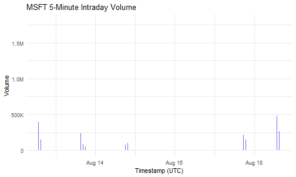
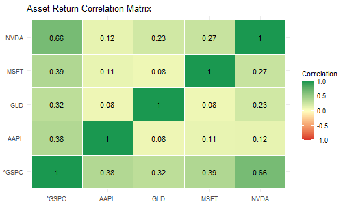
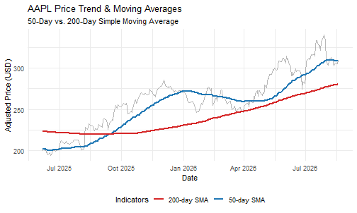

# yahoofinancer Cookbook: 15 Practical Recipes

## Overview

The `yahoofinancer` package provides a tidyverse-first, type-stable
interface for querying market data from Yahoo Finance. This cookbook
compiles 15 end-to-end recipes ranging from baseline data extraction to
technical indicators, quantitative modeling, risk management, and
portfolio performance analysis.

### Required Packages

``` r

library(yahoofinancer)
library(dplyr)
library(tidyr)
library(ggplot2)
library(scales)
library(zoo)
```

------------------------------------------------------------------------

## 1. Download Historical Equity Prices

Retrieve daily Open, High, Low, Close, Adjusted Close, and Volume
(OHLCV) price series for a single security using either functional or
object-oriented (R6) interfaces.

``` r

# Functional API
aapl_prices <- yf_download_prices(
  tickers  = "AAPL",
  period   = "1y",
  interval = "1d"
)

head(aapl_prices)
#> # A tibble: 6 × 8
#>   symbol date                 open  high   low close adj_close
#>   <chr>  <dttm>              <dbl> <dbl> <dbl> <dbl>     <dbl>
#> 1 AAPL   2025-08-18 13:30:00  232.  233.  230.  231.      230.
#> 2 AAPL   2025-08-19 13:30:00  231.  233.  229.  231.      230.
#> 3 AAPL   2025-08-20 13:30:00  230.  230.  226.  226.      225.
#> 4 AAPL   2025-08-21 13:30:00  226.  227.  224.  225.      224.
#> 5 AAPL   2025-08-22 13:30:00  226.  229.  225.  228.      227.
#> 6 AAPL   2025-08-25 13:30:00  226.  229.  226.  227.      226.
#> # ℹ 1 more variable: volume <dbl>

# R6 Class Interface
aapl_obj <- Ticker$new("AAPL")
aapl_history <- aapl_obj$get_history(period = "1y", interval = "1d")

head(aapl_history)
#> # A tibble: 6 × 8
#>   symbol date                 open  high   low close adj_close
#>   <chr>  <dttm>              <dbl> <dbl> <dbl> <dbl>     <dbl>
#> 1 AAPL   2025-08-18 13:30:00  232.  233.  230.  231.      230.
#> 2 AAPL   2025-08-19 13:30:00  231.  233.  229.  231.      230.
#> 3 AAPL   2025-08-20 13:30:00  230.  230.  226.  226.      225.
#> 4 AAPL   2025-08-21 13:30:00  226.  227.  224.  225.      224.
#> 5 AAPL   2025-08-22 13:30:00  226.  229.  225.  228.      227.
#> 6 AAPL   2025-08-25 13:30:00  226.  229.  226.  227.      226.
#> # ℹ 1 more variable: volume <dbl>
```

### Variations & Tips

- **Explicit Date Boundaries**: Query fixed historical windows using
  `start_date` and `end_date`:

``` r

aapl_custom <- yf_download_prices(
  tickers  = "AAPL",
  start    = "2024-01-01",
  end      = "2024-12-31",
  interval = "1d"
)
```

- **Inspect Security Metadata via R6**:

``` r

cat("Currency:    ", aapl_obj$currency, "\n")
#> Currency:     USD
cat("Quote Type:  ", aapl_obj$quote_type, "\n")
#> Quote Type:
cat("Exchange:    ", aapl_obj$exchange, "\n")
#> Exchange:
```

------------------------------------------------------------------------

## 2. Batch Download Multiple Tickers

Retrieve and stack price series for a diversified universe of equities
into a single long-format tibble in one vectorized call.

``` r

symbols <- c("AAPL", "MSFT", "GOOGL", "NVDA", "TCS.NS")

basket_prices <- yf_download_prices(
  tickers  = symbols,
  period   = "6mo",
  interval = "1d"
)

# Inspect observation counts per ticker
basket_prices |>
  count(symbol)
#> # A tibble: 5 × 2
#>   symbol     n
#>   <chr>  <int>
#> 1 AAPL     126
#> 2 GOOGL    126
#> 3 MSFT     126
#> 4 NVDA     126
#> 5 TCS.NS   125
```

### Variations & Tips

- **Faceted Multi-Asset Price Plot**: Compare absolute price
  trajectories across assets using `ggplot2`:

``` r

ggplot(basket_prices, aes(x = date, y = adj_close, color = symbol)) +
  geom_line(show.legend = FALSE) +
  facet_wrap(~ symbol, scales = "free_y") +
  labs(
    title = "Historical Price Series by Security",
    x     = "Date",
    y     = "Adjusted Close Price"
  ) +
  theme_minimal()
```


plot of chunk recipe-2-faceted-plot

------------------------------------------------------------------------

## 3. Intraday Price Series & Timeframes

Retrieve high-frequency intraday candles (`1m`, `5m`, `15m`, `60m`) to
examine intraday volatility, liquidity patterns, and trading
microstructure.

``` r

intraday_5m <- yf_download_prices(
  tickers  = "MSFT",
  period   = "5d",
  interval = "5m"
)

head(intraday_5m)
#> # A tibble: 6 × 8
#>   symbol date                 open  high   low close adj_close
#>   <chr>  <dttm>              <dbl> <dbl> <dbl> <dbl>     <dbl>
#> 1 MSFT   2026-08-12 13:30:00  500.  502.  497.  498.      498.
#> 2 MSFT   2026-08-12 13:35:00  498.  500.  498.  499.      499.
#> 3 MSFT   2026-08-12 13:40:00  499.  499.  497.  498.      498.
#> 4 MSFT   2026-08-12 13:45:00  498.  498.  496.  497.      497.
#> 5 MSFT   2026-08-12 13:50:00  497.  497.  494.  494.      494.
#> 6 MSFT   2026-08-12 13:55:00  494.  494   493.  494.      494.
#> # ℹ 1 more variable: volume <dbl>
```

### Variations & Tips

- **Hourly Candle Tracking**: Download 1-hour candles over the past
  month:

``` r

intraday_1h <- yf_download_prices(
  tickers  = "MSFT",
  period   = "1mo",
  interval = "60m"
)
```

- **Intraday Volume Distribution**: Visualize intraday trading volume
  bars:

``` r

ggplot(intraday_5m, aes(x = date, y = volume)) +
  geom_col(fill = "#4f46e5", alpha = 0.8) +
  scale_y_continuous(labels = label_number(scale_cut = cut_short_scale())) +
  labs(
    title = "MSFT 5-Minute Intraday Volume",
    x     = "Timestamp (UTC)",
    y     = "Volume"
  ) +
  theme_minimal()
```



plot of chunk recipe-3-volume-plot

------------------------------------------------------------------------

## 4. Real-Time Market Overview & Regional Filtering

Retrieve live market snapshots across international equity indices,
currencies, and commodities, then filter for specific regional
exchanges.

``` r

market_overview <- get_market_summary(as_tibble = TRUE)

# Filter for Indian indices and INR currency pairs
indian_market <- market_overview |>
  filter(grepl("NSE|BSE|NIFTY|SENSEX|INR", short_name, ignore.case = TRUE))

print(indian_market)
#> # A tibble: 0 × 9
#> # ℹ 9 variables: symbol <chr>, short_name <chr>,
#> #   regular_market_price <dbl>, regular_market_change <dbl>,
#> #   regular_market_change_percent <dbl>,
#> #   regular_market_previous_close <dbl>, market_state <chr>,
#> #   exchange <chr>, market_time <dttm>
```

### Variations & Tips

- **Filter for Commodities & Crypto**:

``` r

commodities_crypto <- market_overview |>
  filter(grepl("Gold|Crude|Silver|BTC|ETH", short_name, ignore.case = TRUE))
```

- **Alternative Filtering with `stringr`**:

``` r

library(stringr)

european_market <- market_overview |>
  filter(str_detect(short_name, regex("DAX|FTSE|CAC", ignore_case = TRUE)))
```

------------------------------------------------------------------------

## 5. Download Benchmark Index History

Retrieve historical price series for major benchmark indices (`^GSPC`,
`^IXIC`, `^NSEI`, `^BSESN`) and normalize prices to a common base of 100
for comparative performance tracking.

``` r

benchmark_symbols <- c("^GSPC", "^IXIC", "^NSEI", "^BSESN")

benchmark_prices <- yf_download_prices(
  tickers  = benchmark_symbols,
  period   = "1y",
  interval = "1d"
)

# Normalize price levels (Base = 100)
normalized_indices <- benchmark_prices |>
  group_by(symbol) |>
  arrange(date) |>
  mutate(indexed_price = (close / first(close)) * 100) |>
  ungroup()

ggplot(normalized_indices, aes(x = date, y = indexed_price, color = symbol)) +
  geom_line(linewidth = 0.8) +
  labs(
    title = "Global Benchmark Performance (Base = 100)",
    x     = "Date",
    y     = "Normalized Growth",
    color = "Index"
  ) +
  theme_minimal()
```


plot of chunk recipe-5-core

### Variations & Tips

- **Indian Sectoral Indices**: Track major sector sub-indices:

``` r

sectoral_symbols <- c("^CNXIT", "^NSEBANK", "^CNXAUTO")
sectoral_prices  <- yf_download_prices(sectoral_symbols, period = "1y", interval = "1d")
```

- **Index Class R6 Query**:

``` r

nifty <- Index$new("^NSEI")
cat("Index Name:   ", nifty$short_name, "\n")
#> Index Name:
cat("Current Level:", nifty$regular_market_price, "\n")
#> Current Level:
```

------------------------------------------------------------------------

## 6. Historical Currency & Forex Conversions

Convert foreign asset valuations into a local base currency by
retrieving spot and historical foreign exchange rates via ISO 4217
currency pairs.

``` r

# 1. Fetch Apple USD prices
aapl <- yf_download_prices("AAPL", period = "6mo") |>
  mutate(date_day = as.Date(date))

# 2. Fetch USD/INR exchange rates
usd_inr <- currency_converter("USD", "INR", period = "6mo") |>
  mutate(date_day = as.Date(date)) |>
  select(date_day, fx_rate = close)

# 3. Join and compute share price in INR
aapl_inr <- aapl |>
  inner_join(usd_inr, by = "date_day") |>
  mutate(close_inr = close * fx_rate) |>
  select(date_day, close_usd = close, fx_rate, close_inr)

head(aapl_inr)
#> # A tibble: 6 × 4
#>   date_day   close_usd fx_rate close_inr
#>   <date>         <dbl>   <dbl>     <dbl>
#> 1 2026-02-18      264.    90.6    23957.
#> 2 2026-02-19      261.    90.8    23659.
#> 3 2026-02-20      265.    91.0    24088.
#> 4 2026-02-23      266.    90.7    24150.
#> 5 2026-02-24      272.    91.0    24770.
#> 6 2026-02-25      274.    90.9    24932.
```

### Variations & Tips

- **Inspect Available ISO Currency Codes**:

``` r

supported_currencies <- get_currencies()
head(supported_currencies)
#>   short_name          long_name symbol    local_long_name
#> 1        FJD      Fijian Dollar    FJD      Fijian Dollar
#> 2        MXN       Mexican Peso    MXN       Mexican Peso
#> 3        SCR  Seychellois Rupee    SCR  Seychellois Rupee
#> 4        CDF    Congolese Franc    CDF    Congolese Franc
#> 5        GTQ Guatemalan Quetzal    GTQ Guatemalan Quetzal
#> 6        BBD   Barbadian Dollar    BBD   Barbadian Dollar
```

- **Direct Forex Pair Download**: Query exchange rates using the `=X`
  ticker convention:

``` r

fx_basket <- yf_download_prices(c("EURUSD=X", "GBPUSD=X", "USDJPY=X"), period = "3mo")
```

------------------------------------------------------------------------

## 7. Validate Ticker Symbols Before Pipelines

Sanitize, filter, and audit arbitrary universes of ticker symbols prior
to running batch download pipelines to prevent failures caused by
delisted or malformed symbols.

``` r

raw_symbols <- c("AAPL", "INVALID_XYZ", "TCS.NS", "NOT_REAL_123", "MSFT")

# 1. Return valid tickers only
clean_symbols <- validate(raw_symbols)
print(clean_symbols)
#> [1] "AAPL"   "TCS.NS" "MSFT"

# 2. Named logical audit vector
validation_status <- validate(raw_symbols, return_logical = TRUE)
print(validation_status)
#>         AAPL  INVALID_XYZ       TCS.NS NOT_REAL_123         MSFT 
#>         TRUE        FALSE         TRUE        FALSE         TRUE

# 3. Clean inline before download
clean_prices <- yf_download_prices(
  tickers = validate(raw_symbols),
  period  = "3mo"
)

head(clean_prices)
#> # A tibble: 6 × 8
#>   symbol date                 open  high   low close adj_close
#>   <chr>  <dttm>              <dbl> <dbl> <dbl> <dbl>     <dbl>
#> 1 AAPL   2026-05-18 13:30:00  300.  301.  295.  298.      298.
#> 2 AAPL   2026-05-19 13:30:00  297.  301.  296.  299.      299.
#> 3 AAPL   2026-05-20 13:30:00  298.  303.  298.  302.      302.
#> 4 AAPL   2026-05-21 13:30:00  301.  306.  300.  305.      305.
#> 5 AAPL   2026-05-22 13:30:00  306.  311.  306.  309.      309.
#> 6 AAPL   2026-05-26 13:30:00  310.  312.  308.  308.      308.
#> # ℹ 1 more variable: volume <dbl>
```

### Variations & Tips

- **Audit and Warning Log for Rejected Tickers**:

``` r

status <- validate(raw_symbols, return_logical = TRUE)
invalid_tickers <- names(status[!status])

if (length(invalid_tickers) > 0) {
  warning("Dropped invalid tickers: ", paste(invalid_tickers, collapse = ", "))
}
```

------------------------------------------------------------------------

## 8. Calculate Daily Percentage Returns

Calculate simple discrete percentage returns and continuous log returns
across multiple securities using standardized adjusted close prices
(`adj_close`).

``` r

symbols <- c("AAPL", "MSFT", "GOOGL")

returns_df <- yf_download_prices(symbols, period = "1y", interval = "1d") |>
  group_by(symbol) |>
  arrange(date) |>
  mutate(
    daily_return = (adj_close / lag(adj_close)) - 1,
    log_return   = log(adj_close / lag(adj_close))
  ) |>
  filter(!is.na(daily_return)) |>
  ungroup()

head(returns_df)
#> # A tibble: 6 × 10
#>   symbol date                 open  high   low close adj_close
#>   <chr>  <dttm>              <dbl> <dbl> <dbl> <dbl>     <dbl>
#> 1 AAPL   2025-08-19 13:30:00  231.  233.  229.  231.      230.
#> 2 MSFT   2025-08-19 13:30:00  515   515.  509.  510.      506.
#> 3 GOOGL  2025-08-19 13:30:00  203.  203.  200.  202.      201.
#> 4 AAPL   2025-08-20 13:30:00  230.  230.  226.  226.      225.
#> 5 MSFT   2025-08-20 13:30:00  510.  511   504.  506.      502.
#> 6 GOOGL  2025-08-20 13:30:00  201.  201.  197.  199.      199.
#> # ℹ 3 more variables: volume <dbl>, daily_return <dbl>,
#> #   log_return <dbl>
```

### Variations & Tips

- **Visualizing Return Distributions**: Plot overlapping density curves
  to evaluate return dispersion and tail thickness:

``` r

ggplot(returns_df, aes(x = daily_return, fill = symbol)) +
  geom_density(alpha = 0.4) +
  scale_x_continuous(labels = label_percent(accuracy = 0.1)) +
  labs(
    title = "Daily Return Distributions",
    x     = "Daily Percentage Return",
    y     = "Density",
    fill  = "Ticker"
  ) +
  theme_minimal()
```


plot of chunk recipe-8-density-plot

- **Summary Statistics Table**:

``` r

returns_summary <- returns_df |>
  group_by(symbol) |>
  summarise(
    trading_days  = n(),
    mean_daily    = mean(daily_return),
    sd_daily      = sd(daily_return),
    annual_return = mean_daily * 252,
    annual_vol    = sd_daily * sqrt(252)
  )
print(returns_summary)
#> # A tibble: 3 × 6
#>   symbol trading_days mean_daily sd_daily annual_return annual_vol
#>   <chr>         <int>      <dbl>    <dbl>         <dbl>      <dbl>
#> 1 AAPL            251  0.00131     0.0157        0.329       0.250
#> 2 GOOGL           251  0.00230     0.0206        0.580       0.328
#> 3 MSFT            251 -0.0000526   0.0203       -0.0133      0.323
```

------------------------------------------------------------------------

## 9. Multi-Asset Return Correlation Matrix

Reshape multi-asset return series into a wide format to compute pairwise
Pearson correlation coefficients, assess sector co-movement, and
evaluate diversification benefits.

``` r

symbols <- c("AAPL", "MSFT", "NVDA", "GLD", "^GSPC")

prices <- yf_download_prices(symbols, period = "1y", interval = "1d")

returns_matrix <- prices |>
  group_by(symbol) |>
  arrange(date) |>
  mutate(daily_return = (adj_close / lag(adj_close)) - 1) |>
  filter(!is.na(daily_return)) |>
  ungroup() |>
  select(date, symbol, daily_return) |>
  pivot_wider(names_from = symbol, values_from = daily_return) |>
  select(-date)

cor_matrix <- cor(returns_matrix, use = "pairwise.complete.obs")
round(cor_matrix, 2)
#>       AAPL MSFT NVDA  GLD ^GSPC
#> AAPL  1.00 0.11 0.12 0.08  0.38
#> MSFT  0.11 1.00 0.27 0.08  0.39
#> NVDA  0.12 0.27 1.00 0.23  0.66
#> GLD   0.08 0.08 0.23 1.00  0.32
#> ^GSPC 0.38 0.39 0.66 0.32  1.00
```

### Variations & Tips

- **Correlation Heatmap**: Visualize asset correlation tiles using
  `ggplot2`:

``` r

cor_long <- as.data.frame(cor_matrix) |>
  mutate(asset1 = rownames(cor_matrix)) |>
  pivot_longer(-asset1, names_to = "asset2", values_to = "correlation")

ggplot(cor_long, aes(x = asset1, y = asset2, fill = correlation)) +
  geom_tile(color = "white") +
  geom_text(aes(label = round(correlation, 2)), color = "black", size = 4) +
  scale_fill_gradient2(
    low = "#d73027", mid = "#ffffbf", high = "#1a9850",
    midpoint = 0, limit = c(-1, 1), name = "Correlation"
  ) +
  labs(title = "Asset Return Correlation Matrix", x = NULL, y = NULL) +
  theme_minimal()
```



plot of chunk recipe-9-heatmap

- **Rolling 60-Day Pairwise Correlation**: Track correlation stability
  over time:

``` r

rolling_cor <- returns_matrix |>
  mutate(
    roll_cor_aapl_gspc = rollapplyr(
      data      = cbind(AAPL, `^GSPC`),
      width     = 60,
      FUN       = function(x) cor(x[, 1], x[, 2], use = "complete.obs"),
      by.column = FALSE,
      fill      = NA
    )
  )
```

------------------------------------------------------------------------

## 10. Compute Moving Averages & Trend Crossovers

Calculate 50-day and 200-day Simple Moving Averages (SMA) to classify
market trend regimes and detect Golden Cross and Death Cross crossover
signals.

``` r

prices <- yf_download_prices("AAPL", period = "2y", interval = "1d")

sma_df <- prices |>
  arrange(date) |>
  mutate(
    sma_50  = rollmeanr(adj_close, k = 50, fill = NA),
    sma_200 = rollmeanr(adj_close, k = 200, fill = NA),
    regime  = case_when(
      sma_50 > sma_200 ~ "Bullish (SMA50 > SMA200)",
      sma_50 < sma_200 ~ "Bearish (SMA50 < SMA200)",
      TRUE             ~ "Neutral"
    ),
    signal  = case_when(
      sma_50 > sma_200 & lag(sma_50) <= lag(sma_200) ~ "Golden Cross",
      sma_50 < sma_200 & lag(sma_50) >= lag(sma_200) ~ "Death Cross",
      TRUE                                           ~ NA_character_
    )
  )

tail(sma_df |> select(date, close, adj_close, sma_50, sma_200, regime, signal), 6)
#> # A tibble: 6 × 7
#>   date                close adj_close sma_50 sma_200 regime  signal
#>   <dttm>              <dbl>     <dbl>  <dbl>   <dbl> <chr>   <chr> 
#> 1 2026-08-11 13:30:00  305.      305.   309.    279. Bullis… <NA>  
#> 2 2026-08-12 13:30:00  302.      302.   309.    280. Bullis… <NA>  
#> 3 2026-08-13 13:30:00  305.      305.   309.    280. Bullis… <NA>  
#> 4 2026-08-14 13:30:00  306.      306.   309.    280. Bullis… <NA>  
#> 5 2026-08-17 13:30:00  306.      306.   309.    280. Bullis… <NA>  
#> 6 2026-08-18 13:30:00  310.      310.   309.    280. Bullis… <NA>
```

### Variations & Tips

- **Moving Average Overlay Chart**:

``` r

ggplot(filter(sma_df, !is.na(sma_200)), aes(x = date)) +
  geom_line(aes(y = adj_close), color = "gray60", alpha = 0.7, linewidth = 0.5) +
  geom_line(aes(y = sma_50, color = "50-day SMA"), linewidth = 0.9) +
  geom_line(aes(y = sma_200, color = "200-day SMA"), linewidth = 0.9) +
  scale_color_manual(
    name   = "Indicators",
    values = c("50-day SMA" = "#1f77b4", "200-day SMA" = "#d62728")
  ) +
  labs(
    title    = "AAPL Price Trend & Moving Averages",
    subtitle = "50-Day vs. 200-Day Simple Moving Average",
    x        = "Date",
    y        = "Adjusted Price (USD)"
  ) +
  theme_minimal() +
  theme(legend.position = "bottom")
```



plot of chunk recipe-10-ma-chart

- **Exponential Moving Average (EMA)**: Weight recent observations
  higher:

``` r

alpha <- 2 / (20 + 1)
sma_df <- sma_df |>
  mutate(ema_20 = stats::filter(adj_close * alpha, 1 - alpha, method = "recursive", sides = 1))
```

------------------------------------------------------------------------

## 11. Calculate Historical & Maximum Drawdown (MDD)

Compute running peak prices and peak-to-trough percentage drawdowns to
quantify historical capital loss risk, tail risk, and maximum drawdown
limits.

``` r

prices <- yf_download_prices("NVDA", period = "5y", interval = "1d")

drawdown_df <- prices |>
  arrange(date) |>
  mutate(
    peak_price = cummax(adj_close),
    drawdown   = (adj_close - peak_price) / peak_price
  )

max_dd_val <- min(drawdown_df$drawdown, na.rm = TRUE)
worst_row  <- drawdown_df |> filter(drawdown == max_dd_val) |> slice(1)

cat("Maximum Drawdown (MDD):", sprintf("%.2f%%", max_dd_val * 100), "\n")
#> Maximum Drawdown (MDD): -66.34%
cat("Trough Date:           ", format(worst_row$date, "%Y-%m-%d"), "\n")
#> Trough Date:            2022-10-14
cat("Trough Price:          ", round(worst_row$adj_close, 2), "\n")
#> Trough Price:           11.2
cat("Previous Peak Price:   ", round(worst_row$peak_price, 2), "\n")
#> Previous Peak Price:    33.27
```

### Variations & Tips

- **Underwater Area Chart**:

``` r

ggplot(drawdown_df, aes(x = date, y = drawdown)) +
  geom_area(fill = "#d9534f", alpha = 0.4) +
  geom_line(color = "#d9534f", linewidth = 0.7) +
  scale_y_continuous(labels = label_percent()) +
  labs(
    title    = "NVDA Historical Drawdown (Underwater Chart)",
    subtitle = paste0("Max Drawdown: ", sprintf("%.2f%%", max_dd_val * 100)),
    x        = "Date",
    y        = "Drawdown from Peak"
  ) +
  theme_minimal()
```


plot of chunk recipe-11-underwater-chart

- **Multi-Asset MDD Comparison**: Compare worst-case drawdowns across
  securities:

``` r

multi_basket <- yf_download_prices(c("AAPL", "MSFT", "GOOGL", "^GSPC"), period = "5y")

mdd_comparison <- multi_basket |>
  group_by(symbol) |>
  arrange(date) |>
  mutate(
    peak = cummax(adj_close),
    dd   = (adj_close - peak) / peak
  ) |>
  summarise(
    max_drawdown     = min(dd, na.rm = TRUE),
    current_drawdown = last(dd)
  ) |>
  arrange(max_drawdown)

print(mdd_comparison)
#> # A tibble: 4 × 3
#>   symbol max_drawdown current_drawdown
#>   <chr>         <dbl>            <dbl>
#> 1 GOOGL        -0.443          -0.148 
#> 2 MSFT         -0.371          -0.106 
#> 3 AAPL         -0.334          -0.0890
#> 4 ^GSPC        -0.254          -0.0123
```

------------------------------------------------------------------------

## 12. Calculate Stock Beta & CAPM Alpha

Fit a Capital Asset Pricing Model (CAPM) linear regression against a
broad market index to estimate systematic market risk ($`\beta`$) and
abnormal alpha ($`\alpha`$).

``` r

prices <- yf_download_prices(c("AAPL", "^GSPC"), period = "2y", interval = "1d")

returns_wide <- prices |>
  group_by(symbol) |>
  arrange(date) |>
  mutate(daily_return = (adj_close / lag(adj_close)) - 1) |>
  filter(!is.na(daily_return)) |>
  ungroup() |>
  select(date, symbol, daily_return) |>
  pivot_wider(names_from = symbol, values_from = daily_return) |>
  drop_na()

capm_fit <- lm(AAPL ~ `^GSPC`, data = returns_wide)
fit_summary <- summary(capm_fit)

alpha_daily <- coef(capm_fit)[1]
beta        <- coef(capm_fit)[2]
r_squared   <- fit_summary$r.squared

cat("Beta (Systematic Risk):", round(beta, 3), "\n")
#> Beta (Systematic Risk): 1.108
cat("Daily Alpha:           ", sprintf("%.4f%%", alpha_daily * 100), "\n")
#> Daily Alpha:            0.0049%
cat("Annualized Alpha:      ", sprintf("%.2f%%", alpha_daily * 252 * 100), "\n")
#> Annualized Alpha:       1.23%
cat("R-Squared:             ", round(r_squared, 3), "\n")
#> R-Squared:              0.391
```

### Variations & Tips

- **CAPM Regression Scatter Plot**:

``` r

ggplot(returns_wide, aes(x = `^GSPC`, y = AAPL)) +
  geom_point(alpha = 0.4, color = "#2c3e50") +
  geom_smooth(method = "lm", color = "#e74c3c", se = TRUE) +
  scale_x_continuous(labels = label_percent()) +
  scale_y_continuous(labels = label_percent()) +
  labs(
    title    = "AAPL vs. S&P 500 (CAPM Beta Regression)",
    subtitle = paste0("Beta = ", round(beta, 2), " | R² = ", round(r_squared, 2)),
    x        = "S&P 500 Daily Return",
    y        = "AAPL Daily Return"
  ) +
  theme_minimal()
```


plot of chunk recipe-12-regression-plot

- **Batch Beta Calculation for Indian Stocks**:

``` r

in_basket  <- c("TCS.NS", "INFY.NS", "RELIANCE.NS", "HDFCBANK.NS", "^NSEI")
in_prices  <- yf_download_prices(in_basket, period = "2y", interval = "1d")

in_returns <- in_prices |>
  group_by(symbol) |>
  arrange(date) |>
  mutate(ret = (adj_close / lag(adj_close)) - 1) |>
  filter(!is.na(ret)) |>
  ungroup() |>
  select(date, symbol, ret) |>
  pivot_wider(names_from = symbol, values_from = ret) |>
  drop_na()

stocks <- setdiff(names(in_returns), c("date", "^NSEI"))
beta_table <- tibble(
  symbol = stocks,
  beta   = sapply(stocks, function(s) cov(in_returns[[s]], in_returns[["^NSEI"]]) / var(in_returns[["^NSEI"]]))
) |> arrange(desc(beta))

print(beta_table)
#> # A tibble: 4 × 2
#>   symbol       beta
#>   <chr>       <dbl>
#> 1 HDFCBANK.NS 1.08 
#> 2 RELIANCE.NS 1.04 
#> 3 INFY.NS     0.924
#> 4 TCS.NS      0.845
```

------------------------------------------------------------------------

## 13. Portfolio Cumulative Returns & Wealth Index (Growth of \$10,000)

Simulate a multi-asset portfolio, compound daily percentage returns over
time, and compare the growth of a hypothetical \$10,000 investment
against the S&P 500 index.

``` r

tickers <- c("AAPL", "MSFT", "NVDA", "^GSPC")

prices <- yf_download_prices(tickers, period = "2y", interval = "1d")

returns_df <- prices |>
  group_by(symbol) |>
  arrange(date) |>
  mutate(daily_return = (adj_close / lag(adj_close)) - 1) |>
  filter(!is.na(daily_return)) |>
  ungroup()

# Equal-weighted tech basket
portfolio_returns <- returns_df |>
  filter(symbol != "^GSPC") |>
  group_by(date) |>
  summarise(daily_return = mean(daily_return), .groups = "drop") |>
  mutate(symbol = "Equal-Weight Tech Portfolio")

benchmark_returns <- returns_df |>
  filter(symbol == "^GSPC") |>
  select(date, symbol, daily_return)

wealth_df <- bind_rows(portfolio_returns, benchmark_returns) |>
  group_by(symbol) |>
  arrange(date) |>
  mutate(
    cum_return   = cumprod(1 + daily_return) - 1,
    wealth_index = 10000 * cumprod(1 + daily_return)
  ) |>
  ungroup()

wealth_df |>
  group_by(symbol) |>
  slice_tail(n = 1) |>
  select(symbol, date, cum_return, wealth_index)
#> # A tibble: 2 × 4
#> # Groups:   symbol [2]
#>   symbol                date                cum_return wealth_index
#>   <chr>                 <dttm>                   <dbl>        <dbl>
#> 1 Equal-Weight Tech Po… 2026-08-18 13:30:00      0.471       14715.
#> 2 ^GSPC                 2026-08-18 13:30:00      0.373       13735.
```

### Variations & Tips

- **Growth of \$10,000 Visualization**:

``` r

ggplot(wealth_df, aes(x = date, y = wealth_index, color = symbol)) +
  geom_line(linewidth = 0.9) +
  scale_y_continuous(labels = label_dollar(prefix = "$")) +
  labs(
    title = "Growth of $10,000: Tech Portfolio vs. S&P 500",
    x     = "Date",
    y     = "Portfolio Value ($)",
    color = "Strategy"
  ) +
  theme_minimal() +
  theme(legend.position = "bottom")
```


plot of chunk recipe-13-wealth-plot

- **Custom Asset Allocation Weights**:

``` r

weights <- c("NVDA" = 0.50, "AAPL" = 0.30, "MSFT" = 0.20)

custom_port <- returns_df |>
  filter(symbol %in% names(weights)) |>
  mutate(weight = weights[symbol]) |>
  group_by(date) |>
  summarise(daily_return = sum(daily_return * weight), .groups = "drop") |>
  mutate(
    cum_return   = cumprod(1 + daily_return) - 1,
    wealth_index = 10000 * cumprod(1 + daily_return)
  )
```

------------------------------------------------------------------------

## 14. Calculate Sharpe Ratio & Risk-Adjusted Metrics

Evaluate asset risk efficiency by computing annualized return,
volatility, downside deviation, the **Sharpe Ratio**, and the **Sortino
Ratio** relative to a risk-free benchmark rate ($`R_f`$).

``` r

prices <- yf_download_prices(c("AAPL", "MSFT", "NVDA", "^GSPC"), period = "2y", interval = "1d")

rf_annual <- 0.04
rf_daily  <- rf_annual / 252

performance_metrics <- prices |>
  group_by(symbol) |>
  arrange(date) |>
  mutate(
    daily_return  = (adj_close / lag(adj_close)) - 1,
    excess_return = daily_return - rf_daily
  ) |>
  filter(!is.na(daily_return)) |>
  summarise(
    trading_days      = n(),
    annual_return     = mean(daily_return) * 252,
    annual_volatility = sd(daily_return) * sqrt(252),
    sharpe_ratio      = (annual_return - rf_annual) / annual_volatility,
    downside_vol      = sqrt(mean(pmin(excess_return, 0)^2)) * sqrt(252),
    sortino_ratio     = (annual_return - rf_annual) / downside_vol,
    .groups           = "drop"
  ) |>
  arrange(desc(sharpe_ratio))

print(performance_metrics)
#> # A tibble: 4 × 7
#>   symbol trading_days annual_return annual_volatility sharpe_ratio
#>   <chr>         <int>         <dbl>             <dbl>        <dbl>
#> 1 ^GSPC           500         0.173             0.162        0.820
#> 2 NVDA            500         0.368             0.451        0.727
#> 3 AAPL            500         0.204             0.288        0.570
#> 4 MSFT            500         0.115             0.288        0.259
#> # ℹ 2 more variables: downside_vol <dbl>, sortino_ratio <dbl>
```

### Variations & Tips

- **Risk vs. Return Bubble Chart**:

``` r

ggplot(performance_metrics, aes(x = annual_volatility, y = annual_return, color = symbol)) +
  geom_point(aes(size = sharpe_ratio), alpha = 0.8) +
  geom_text(aes(label = symbol), vjust = -1.2, fontface = "bold") +
  geom_hline(yintercept = rf_annual, linetype = "dashed", color = "gray50") +
  scale_x_continuous(labels = label_percent()) +
  scale_y_continuous(labels = label_percent()) +
  scale_size_continuous(range = c(4, 10), name = "Sharpe Ratio") +
  labs(
    title    = "Risk vs. Return Profile",
    subtitle = "Bubble size represents Sharpe Ratio",
    x        = "Annualized Risk / Volatility",
    y        = "Annualized Return"
  ) +
  theme_minimal() +
  theme(legend.position = "right")
```


plot of chunk recipe-14-bubble-plot

------------------------------------------------------------------------

## 15. Compute Bollinger Bands & Volatility Envelopes

Construct 20-day volatility envelopes ($`\text{SMA}_{20} \pm 2\sigma`$),
compute $`\%B`$ and Bandwidth indicators, and screen a universe of
stocks for volatility breakouts.

``` r

# 1. Download prices for a single security
prices <- yf_download_prices("MSFT", period = "1y", interval = "1d")

# 2. Compute Bollinger Bands, %B, and Bandwidth
bb_df <- prices |>
  filter(!is.na(adj_close)) |>
  arrange(date) |>
  mutate(
    bb_middle = rollmeanr(adj_close, k = 20, fill = NA),
    bb_sd     = rollapplyr(adj_close, width = 20, FUN = sd, fill = NA),
    bb_upper  = bb_middle + (2 * bb_sd),
    bb_lower  = bb_middle - (2 * bb_sd),
    bb_pct_b  = (adj_close - bb_lower) / (bb_upper - bb_lower),
    bandwidth = (bb_upper - bb_lower) / bb_middle
  )

tail(bb_df |> select(date, adj_close, bb_lower, bb_middle, bb_upper, bb_pct_b, bandwidth), 6)
#> # A tibble: 6 × 7
#>   date                adj_close bb_lower bb_middle bb_upper
#>   <dttm>                  <dbl>    <dbl>     <dbl>    <dbl>
#> 1 2026-08-11 13:30:00      504.     334.      436.     537.
#> 2 2026-08-12 13:30:00      492.     338.      440.     543.
#> 3 2026-08-13 13:30:00      497.     342.      445.     549.
#> 4 2026-08-14 13:30:00      495.     347.      450.     553.
#> 5 2026-08-17 13:30:00      480.     353.      454.     555.
#> 6 2026-08-18 13:30:00      481.     360.      458.     557.
#> # ℹ 2 more variables: bb_pct_b <dbl>, bandwidth <dbl>
```

### Variations & Tips

- **Bollinger Bands Ribbon Plot**:

``` r

ggplot(filter(bb_df, !is.na(bb_upper)), aes(x = date)) +
  geom_ribbon(aes(ymin = bb_lower, ymax = bb_upper), fill = "#e0e7ff", alpha = 0.6) +
  geom_line(aes(y = bb_upper), color = "#4f46e5", linetype = "dashed", linewidth = 0.5) +
  geom_line(aes(y = bb_middle), color = "#3b82f6", linewidth = 0.8) +
  geom_line(aes(y = bb_lower), color = "#4f46e5", linetype = "dashed", linewidth = 0.5) +
  geom_line(aes(y = adj_close), color = "#1e293b", linewidth = 0.7) +
  labs(
    title    = "MSFT Price with 20-Day Bollinger Bands (±2σ)",
    subtitle = "Shaded channel represents standard volatility envelope",
    x        = "Date",
    y        = "Adjusted Price (USD)"
  ) +
  theme_minimal()
```


plot of chunk recipe-15-ribbon-plot

- **Multi-Ticker Volatility Breakout Screener**:

``` r

watchlist <- c("AAPL", "MSFT", "NVDA", "GOOGL", "AMZN")

screener_results <- yf_download_prices(watchlist, period = "6mo", interval = "1d") |>
  filter(!is.na(adj_close) & !is.na(close)) |>
  group_by(symbol) |>
  arrange(date, .by_group = TRUE) |>
  mutate(
    mb    = rollmeanr(adj_close, k = 20, fill = NA),
    sd    = rollapplyr(adj_close, width = 20, FUN = sd, fill = NA),
    ub    = mb + (2 * sd),
    lb    = mb - (2 * sd),
    pct_b = (adj_close - lb) / (ub - lb)
  ) |>
  filter(!is.na(pct_b)) |>
  slice_tail(n = 1) |>
  ungroup() |>
  mutate(
    status = case_when(
      pct_b > 1.0 ~ "Above Upper Band (Overbought/Breakout)",
      pct_b < 0.0 ~ "Below Lower Band (Oversold/Breakdown)",
      TRUE        ~ "Within Normal Bands"
    )
  ) |>
  select(symbol, date, close = adj_close, ub, lb, pct_b, status)

print(screener_results)
#> # A tibble: 5 × 7
#>   symbol date                close    ub    lb pct_b status        
#>   <chr>  <dttm>              <dbl> <dbl> <dbl> <dbl> <chr>         
#> 1 AAPL   2026-08-18 13:30:00  310.  342.  290. 0.371 Within Normal…
#> 2 AMZN   2026-08-18 13:30:00  260.  296.  219. 0.535 Within Normal…
#> 3 GOOGL  2026-08-18 13:30:00  343.  377.  314. 0.455 Within Normal…
#> 4 MSFT   2026-08-18 13:30:00  481.  557.  360. 0.617 Within Normal…
#> 5 NVDA   2026-08-18 13:30:00  220.  235.  189. 0.672 Within Normal…
```
